# Отчёт по дз4

Была осуществлена de novo сборка генома с помощью Velvet и SPAdes, сравнение сборок через QUAST и попытка улучшения результата.
Работа выполнялась на сервере через **SLURM**.

---

## Задачи:

1) Выполнить несколько сборок Velvet с разными значениями k-mer;
2) Затем собрать те же данные через SPAdes;
3) Сравнить полученные сборки с помощью QUAST;
4) Улучшить сборку изменением параметров.

---

## Часть 1 — Сборка с Velvet

Для Velvet были выполнены три сборки с k-mer **11**, **21** и **31**. Значения больше 31 не использовались, потому что установленная на сервере версия Velvet имеет ограничение по максимальной длине. Для каждого значения k-mer создавалась отдельная папка результата.

### Скрипт для запуска Velvet

<p align="center">
  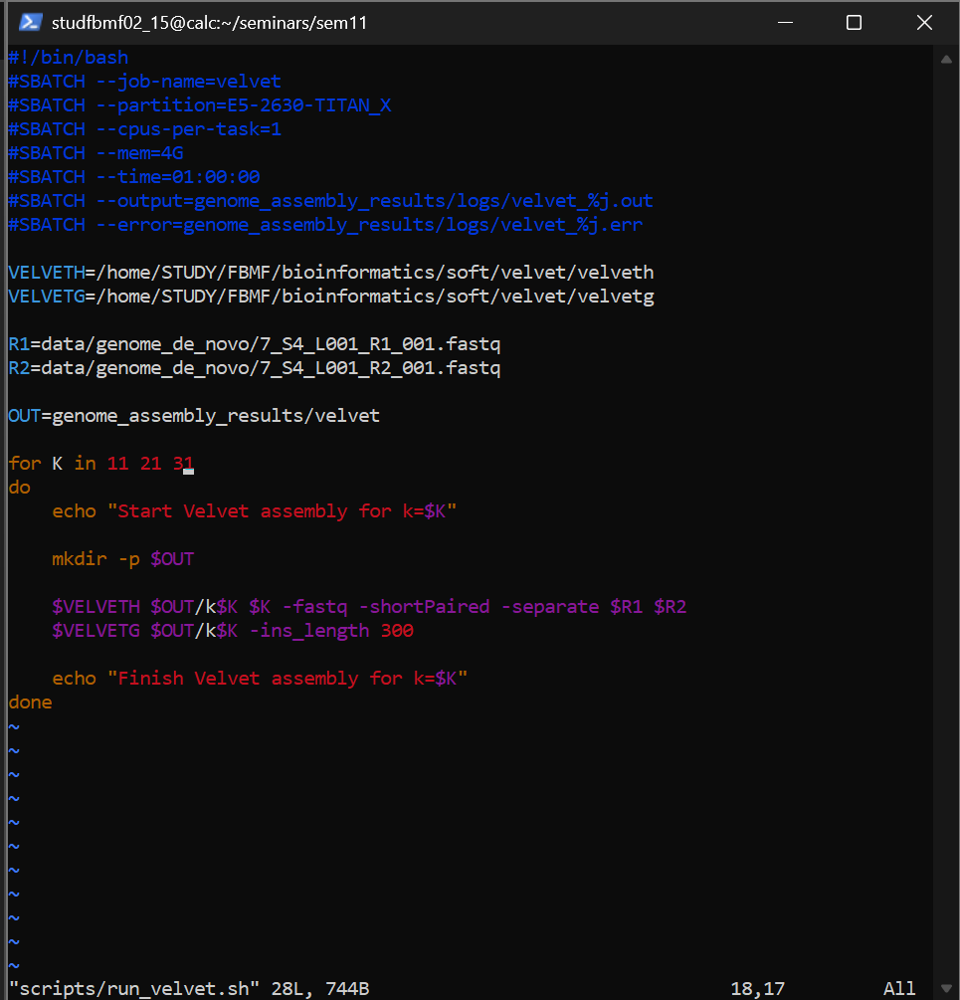
</p>

<p align="center"><em>Рисунок 1. SLURM-скрипт для запуска Velvet.</em></p>

Команды запуска и проверки:

```bash
sbatch scripts/run_velvet.sh
sacct -j 67317 --format=JobID,JobName,State,ExitCode,Elapsed
ls -la --time=ctime genome_assembly_results/velvet
find genome_assembly_results/velvet -maxdepth 2 -name "contigs.fa" -print
grep "Start Velvet\|Final graph\|Finish Velvet" genome_assembly_results/logs/velvet_67317.out
```

<p align="center">
  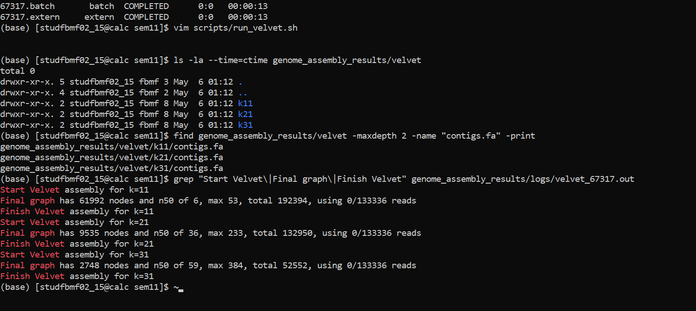
</p>

<p align="center"><em>Рисунок 2. Проверка статуса Velvet, созданных папок и файлов contigs.fa.</em></p>

### Результат

Задача SLURM завершилась со статусом `COMPLETED`. В папке результатов появились директории `k11`, `k21` и `k31`. В каждой директории был создан основной файл сборки `contigs.fa`.

Из лога Velvet:

| k-mer | nodes | N50 | max contig | total length |
|---:|---:|---:|---:|---:|
| 11 | 61992 | 6 | 53 | 192394 |
| 21 | 9535 | 36 | 233 | 132950 |
| 31 | 2748 | 59 | 384 | 52552 |

При увеличении k-mer от 11 до 31 число узлов графа уменьшается, а N50 и максимальная длина контига увеличиваются. Поэтому среди Velvet-сборок предварительно лучше выглядит `k31`. Окончательное сравнение делалось через QUAST во второй части.

---

## Часть 2 — Сравнение Velvet и SPAdes через QUAST

Для сравнения была выполнена базовая сборка SPAdes на тех же входных FASTQ-файлах. Затем с помощью QUAST были сравнены четыре сборки:

- `velvet_k11`
- `velvet_k21`
- `velvet_k31`
- `spades_old`

### Скрипт запуска SPAdes

<p align="center">
  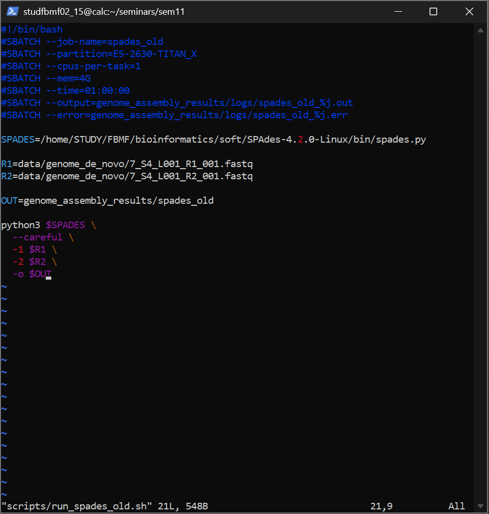
</p>

<p align="center"><em>Рисунок 3. Скрипт для запуска SPAdes.</em></p>

Команды запуска и проверки SPAdes были такими же, как при проверке Velvet.

<p align="center">
  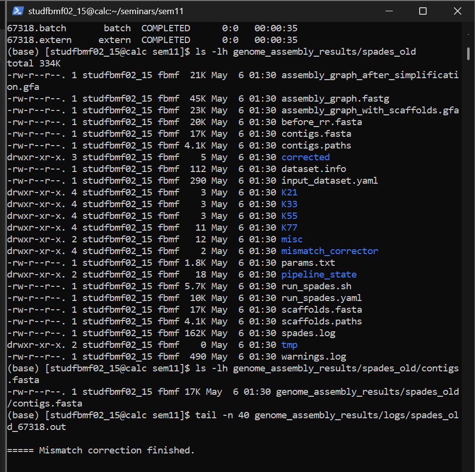
</p>

<p align="center"><em>Рисунок 4. Результаты SPAdes.</em></p>

### Результат SPAdes

Файл `contigs.fasta` был создан в папке `genome_assembly_results/spades_old`. В логе были предупреждения, но они не остановили сборку, поэтому результат можно использовать для сравнения.

### Скрипт запуска QUAST

<p align="center">
  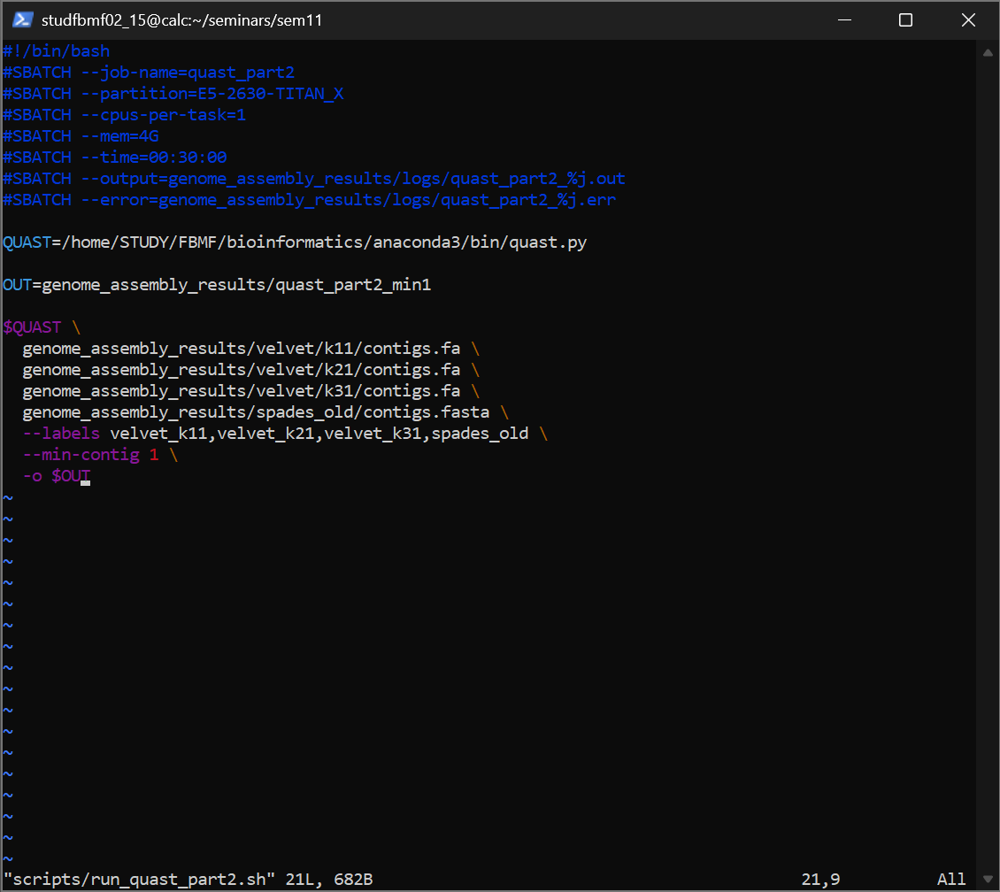
</p>

<p align="center"><em>Рисунок 5. Скрипт QUAST для сравнения Velvet и SPAdes.</em></p>

**Параметр `--min-contig 1`.** 
По умолчанию QUAST считает основную статистику по контигам длиной от 500 bp. У Velvet в этой работе получились короткие контиги, поэтому без этого параметра Velvet-сборки почти не попадали в итоговую таблицу. Поэтому `--min-contig 1` был добавлен, чтобы сравнение всех сборок было видно в отчете.

Запуск и проверка QUAST:

```bash
sbatch scripts/run_quast_part2.sh
sacct -j 67320 --format=JobID,JobName,State,ExitCode,Elapsed
ls -lh genome_assembly_results/quast_part2_min1
cat genome_assembly_results/quast_part2_min1/report.txt
```

<p align="center">
  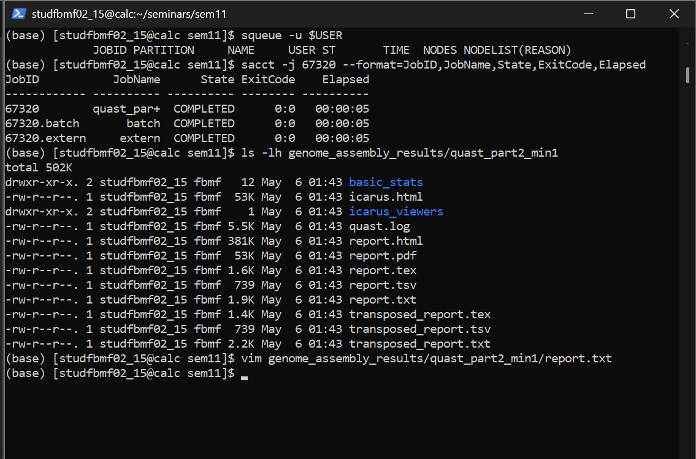
</p>

<p align="center"><em>Рисунок 6. Статус QUAST и созданные файлы отчета.</em></p>

<p align="center">
  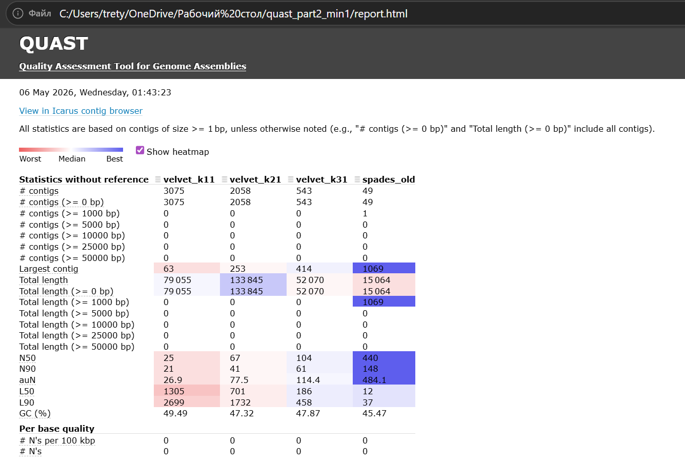
</p>

<p align="center"><em>Рисунок 7. Таблица QUAST из report.html (part2).</em></p>

### Основные метрики QUAST

| Метрика | velvet_k11 | velvet_k21 | velvet_k31 | spades_old |
|---|---:|---:|---:|---:|
| # contigs | 3075 | 2058 | 543 | 49 |
| Largest contig | 63 | 253 | 414 | 1069 |
| Total length | 79055 | 133845 | 52070 | 15064 |
| N50 | 25 | 67 | 104 | 440 |
| N90 | 21 | 41 | 61 | 148 |
| L50 | 1305 | 701 | 186 | 12 |
| L90 | 2699 | 1732 | 458 | 37 |
| GC (%) | 49.49 | 47.32 | 47.87 | 45.47 |

### Вывод по сравнению

Среди Velvet-сборок лучше всего выглядит `velvet_k31`: у нее меньше контигов, выше N50 и больше largest contig, чем у `velvet_k11` и `velvet_k21`.

При этом SPAdes показывает лучшие показатели связности по сравнению со всеми Velvet-сборками: у SPAdes меньше всего контигов, самый большой largest contig и наибольшее значение N50.

Таким образом, по результатам QUAST лучшей сборкой в этой части можно считать `spades_old`. У нее 49 контигов, `largest contig = 1069` и `N50 = 440`. Для сравнения, лучшая сборка Velvet — `velvet_k31` — имеет 543 контига, `largest contig = 414` и `N50 = 104`. Это означает, что SPAdes дал менее фрагментированную сборку.

---

## Часть 3 — Улучшение сборки

В третьей части нужно было попробовать улучшить сборку: сделать одну новую сборку через SPAdes, одну новую сборку через Velvet, затем снова запустить QUAST и сравнить четыре варианта: старый и новый SPAdes, старый и новый Velvet.

### Первая попытка улучшения v1

Сначала была сделана простая попытка улучшить сборки за счёт параметров. Для Velvet был оставлен `k=31`, потому что в первой части это был лучший вариант среди Velvet-сборок, и была добавлена автоматическая оценка покрытия: `-exp_cov auto` и `-cov_cutoff auto`.

Было предположение, что Velvet сам оценит ожидаемое покрытие и отсечёт часть слабых участков графа. Для SPAdes была сделана новая сборка с другим вариантом параметров, чтобы проверить, изменятся ли основные метрики.

Логика первой версии улучшения:

```bash
# Velvet v1: k=31 + автоматическая оценка покрытия
velveth genome_assembly_results/velvet_new_k31 31 -fastq -shortPaired -separate R1 R2
velvetg genome_assembly_results/velvet_new_k31 -ins_length 300 -exp_cov auto -cov_cutoff auto

# SPAdes v1: новая сборка SPAdes на тех же FASTQ-файлах
python3 spades.py -1 R1 -2 R2 -o genome_assembly_results/spades_new

# QUAST v1: сравнение old/new Velvet и old/new SPAdes
quast.py velvet_old_k31 velvet_new_k31 spades_old spades_new --min-contig 1
```

По первой попытке стало видно, что простое изменение параметров не дало как такового улучшения. `velvet_new_k31` по основным метрикам практически совпал со старым Velvet k31, а новая сборка SPAdes стала более фрагментированной, чем исходная SPAdes-сборка. Поэтому я решила попробовать другое улучшение.

| Метрика | velvet_old_k31 | velvet_new_k31 | spades_old | spades_new |
|---|---:|---:|---:|---:|
| # contigs | 543 | 543 | 49 | 274 |
| Largest contig | 414 | 414 | 1069 | 882 |
| Total length | 52070 | 52070 | 15064 | 33662 |
| N50 | 104 | 104 | 440 | 110 |
| L50 | 186 | 186 | 12 | 70 |
| L90 | 458 | 458 | 37 | 217 |
| GC (%) | 47.87 | 47.87 | 45.47 | 47.52 |

### Вторая попытка улучшения v2

Во второй попытке идея была такая: сначала SPAdes в режиме `--careful` исправляет ошибки в ридах и сохраняет исправленные файлы в папку `corrected`. Затем эти исправленные paired-end риды были поданы на вход Velvet.

Это может помочь, потому что ошибки секвенирования создают лишние k-mer и усложняют граф сборки. Если сначала исправить риды, то у Velvet граф может стать менее шумным.

Также была сделана отдельная сборка SPAdes с параметром `--isolate`. Я использовала этот режим как ещё один вариант улучшения, чтобы проверить, получится ли сборка менее раздробленной.

### Скрипт Velvet на исправленных ридах

<p align="center">
  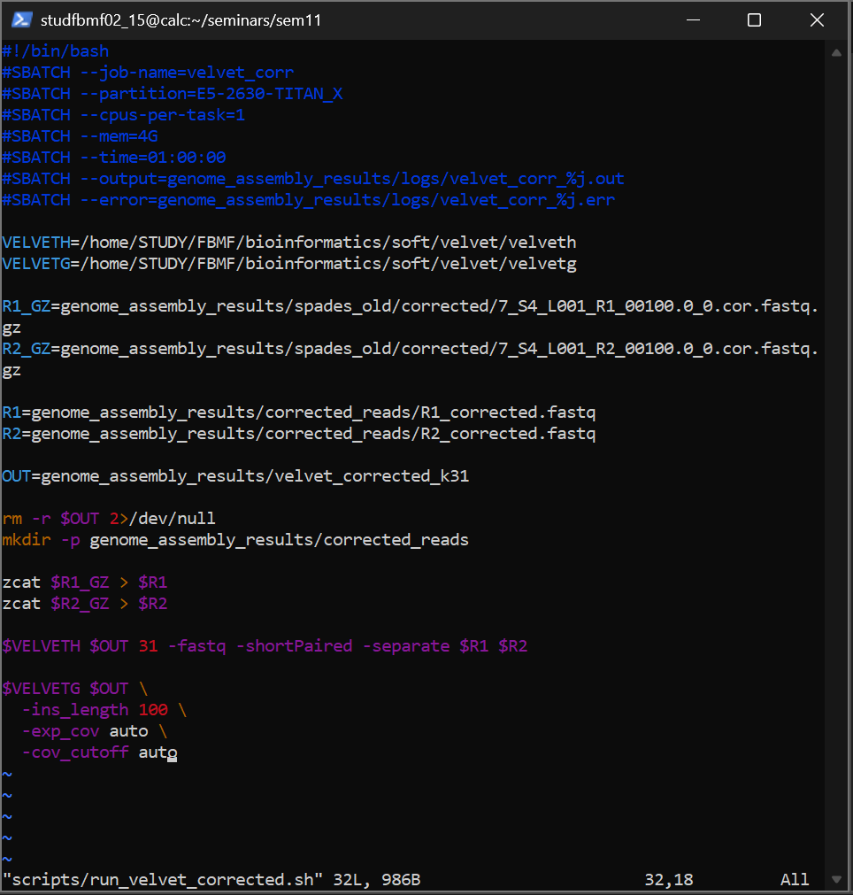
</p>

<p align="center"><em>Рисунок 8. Скрипт run_velvet_corrected.sh для Velvet-сборки на исправленных ридах.</em></p>

### Скрипт SPAdes isolate

<p align="center">
  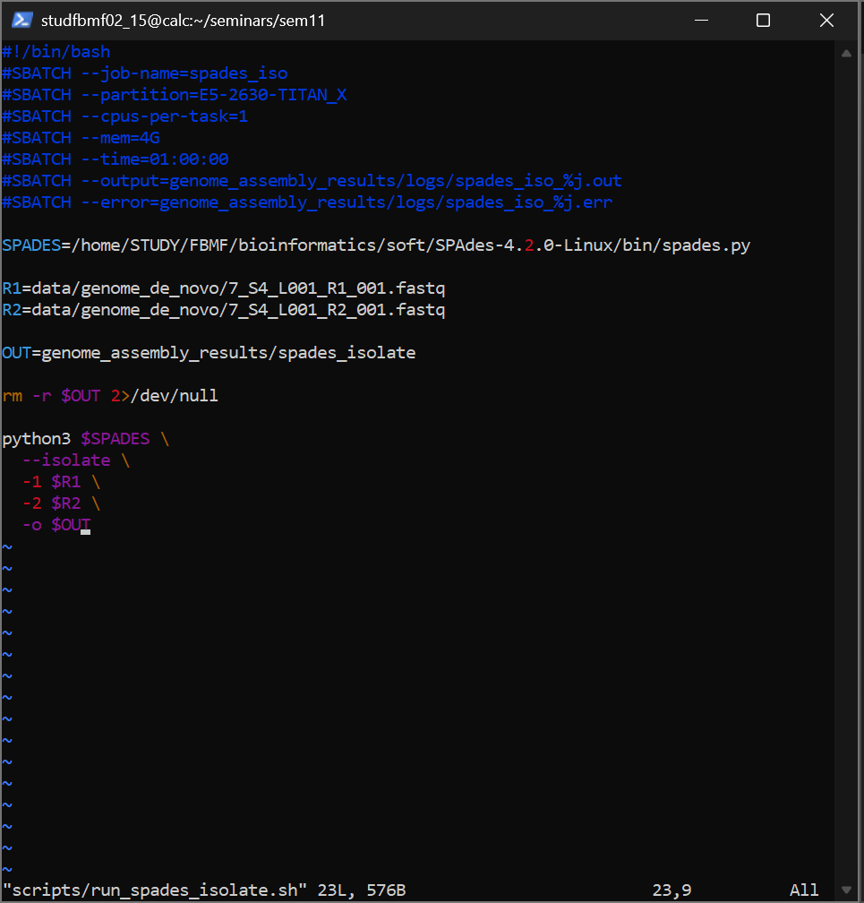
</p>

<p align="center"><em>Рисунок 9. Скрипт run_spades_isolate.sh для новой SPAdes-сборки в режиме --isolate.</em></p>

### Финальный QUAST для части 3

После выполнения новых сборок был запущен финальный QUAST. В него были переданы четыре сборки:

- старый Velvet k31;
- Velvet на corrected reads;
- старый SPAdes;
- SPAdes isolate.

Использовался параметр `--min-contig 1`, как и во второй части, чтобы короткие Velvet-контиги тоже отображались в сравнении.

### Скрипт запуска QUAST для части 3

<p align="center">
  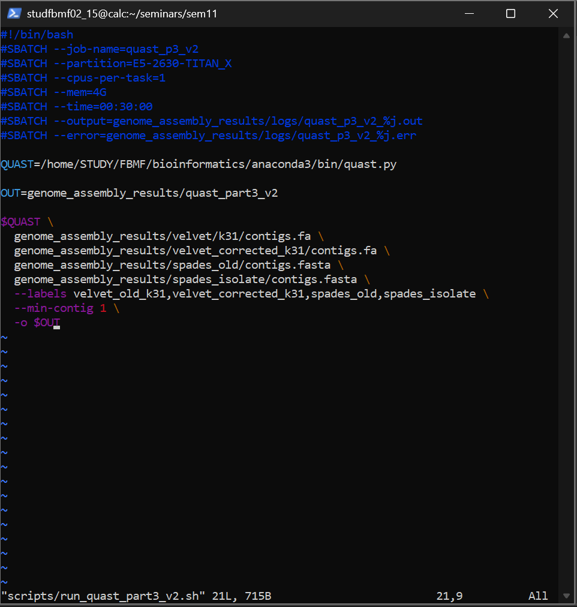
</p>

<p align="center"><em>Рисунок 10. Скрипт run_quast_part3_v2.sh для финального сравнения четырёх сборок.</em></p>

Команды запуска и проверки финального QUAST:

```bash
sbatch scripts/run_quast_part3_v2.sh
sacct -j 67384 --format=JobID,JobName,State,ExitCode,Elapsed
ls -lh genome_assembly_results/quast_part3_v2
vim genome_assembly_results/quast_part3_v2/report.txt
```
В папке `quast_part3_v2` были созданы `report.html`, `report.txt`, `report.pdf` и другие файлы отчета.

<p align="center">
  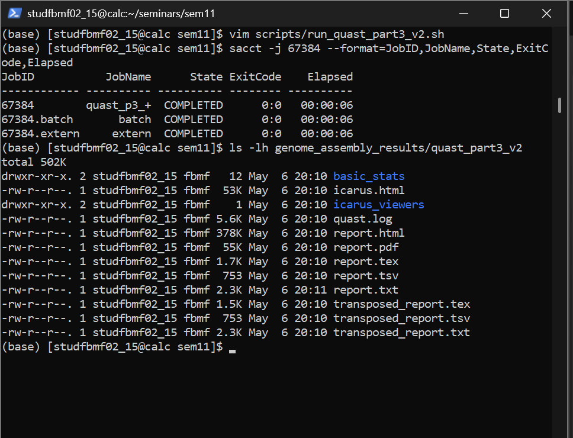
</p>

<p align="center"><em>Рисунок 11. Проверка статуса финального QUAST и созданных файлов отчета.</em></p>

### Результаты QUAST для финального сравнения

<p align="center">
  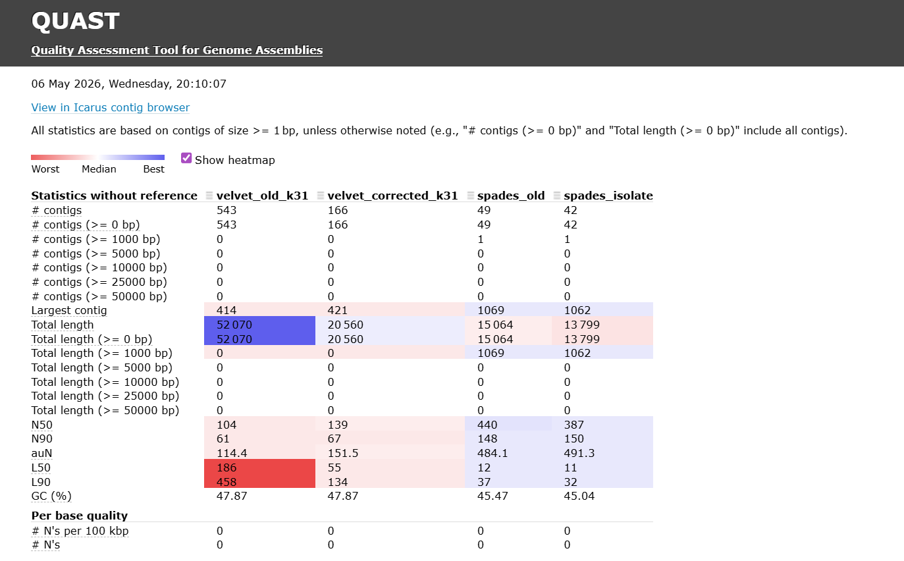
</p>

<p align="center"><em>Рисунок 12. Таблица QUAST из report.html (part3) для старых и новых сборок.</em></p>

| Метрика | velvet_old_k31 | velvet_corrected_k31 | spades_old | spades_isolate |
|---|---:|---:|---:|---:|
| # contigs | 543 | 166 | 49 | 42 |
| Largest contig | 414 | 421 | 1069 | 1062 |
| Total length | 52070 | 20560 | 15064 | 13799 |
| N50 | 104 | 139 | 440 | 387 |
| N90 | 61 | 67 | 148 | 150 |
| auN | 114.4 | 151.5 | 484.1 | 491.3 |
| L50 | 186 | 55 | 12 | 11 |
| L90 | 458 | 134 | 37 | 32 |
| GC (%) | 47.87 | 47.87 | 45.47 | 45.04 |

### Анализ результатов части 3

Для Velvet улучшение получилось заметным. После использования исправленных ридов число контигов уменьшилось с 543 до 166, N50 выросло со 104 до 139, а largest contig немного увеличился с 414 до 421. Это похоже на реальное улучшение по фрагментированности: сборка стала состоять из меньшего числа фрагментов, и средняя связность стала выше.

При этом total length у Velvet уменьшился с 52070 до 20560. То есть, часть коротких или слабо поддержанных фрагментов могла быть отброшена после коррекции ридов и автоматического cutoff. Поэтому corrected Velvet выглядит лучше по связности, но нельзя сказать, что он однозначно лучше по всем возможным критериям.

Для SPAdes режим `--isolate` дал смешанный результат. Число контигов уменьшилось с 49 до 42, L50 немного улучшилось с 12 до 11, но N50 снизилось с 440 до 387, а largest contig немного уменьшился с 1069 до 1062. Поэтому SPAdes isolate нельзя считать однозначным улучшением старой SPAdes-сборки.

---

## Итоговые выводы

В первой части были выполнены Velvet-сборки с k-mer 11, 21 и 31. Среди них лучше всего выглядела сборка `k31`: при росте k-mer уменьшалось число фрагментов графа, а N50 и largest contig становились больше.

Во второй части Velvet-сборки были сравнены со сборкой SPAdes через QUAST. По основным метрикам связности SPAdes оказался лучше Velvet: у него было меньше контигов, выше N50 и больше largest contig.

В третьей части были проверены варианты улучшения сборок. Первая простая попытка с изменением параметров не дала хорошего результата. Более удачной оказалась идея использовать corrected reads из SPAdes как вход для Velvet: число контигов у Velvet уменьшилось с 543 до 166, а N50 выросло со 104 до 139.

Лучшей сборкой по основным QUAST-метрикам осталась старая сборка SPAdes, потому что у нее `N50 = 440` и `largest contig = 1069`. При этом среди Velvet-сборок лучшим вариантом стала сборка Velvet на corrected reads. Но всё же без референсного генома эти выводы основаны именно на статистиках QUAST, а не на полной проверке биологической правильности сборки.
