# Отчёт по дз5

Был выполнен контроль качества FASTQ-данных из проекта PRJEB84057 с помощью FastQC и MultiQC, затем проведён тримминг ридов через fastp и повторная проверка качества после обработки. Работа выполнялась на сервере через **SLURM**.

---

## Задачи:

1) Скачать 4 FASTQ-файла из проекта PRJEB84057;
2) Запустить FastQC для исходных данных;
3) Собрать общий отчёт MultiQC до тримминга;
4) По отчёту определить наличие адаптеров, плохого качества на концах ридов и других проблем;
5) Выполнить тримминг через fastp с auto-detection адаптеров, окном качества 5:20 и минимальной длиной 36 нуклеотидов;
6) Повторно запустить FastQC и MultiQC для очищенных файлов;
7) Сравнить результаты до и после тримминга и сделать выводы.

---

## Часть 1 — Анализ FastQC до тримминга

В первой части нужно было скачать 4 FASTQ-файла из проекта PRJEB84057, запустить для них FastQC и собрать общий отчёт MultiQC. После этого нужно по отчёту понять, есть ли в данных явные проблемы: адаптеры, плохое качество на концах ридов, большое количество N, проблемы с длиной ридов, дупликация и сверхпредставленные последовательности.

После скачивания в папке data находились 4 файла: ERR14230595.fastq.gz, ERR14230600.fastq.gz, ERR14230602.fastq.gz и ERR14230607.fastq.gz.

Для выполнения первой части была создана отдельная conda-среда `hw5_qc`, чтобы все нужные программы были установлены в одном месте и не конфликтовали с другими пакетами на сервере. В эту среду были установлены основные инструменты для контроля качества и дальнейшей обработки данных: `FastQC`, `MultiQC` и `fastp`.

FastQC использовался для проверки качества каждого FASTQ-файла отдельно. MultiQC был нужен, чтобы объединить все отчёты FastQC в один общий HTML-отчёт. fastp был установлен сразу, так как он использовался дальше для тримминга ридов во второй части работы.

### Скрипт FastQC до тримминга

  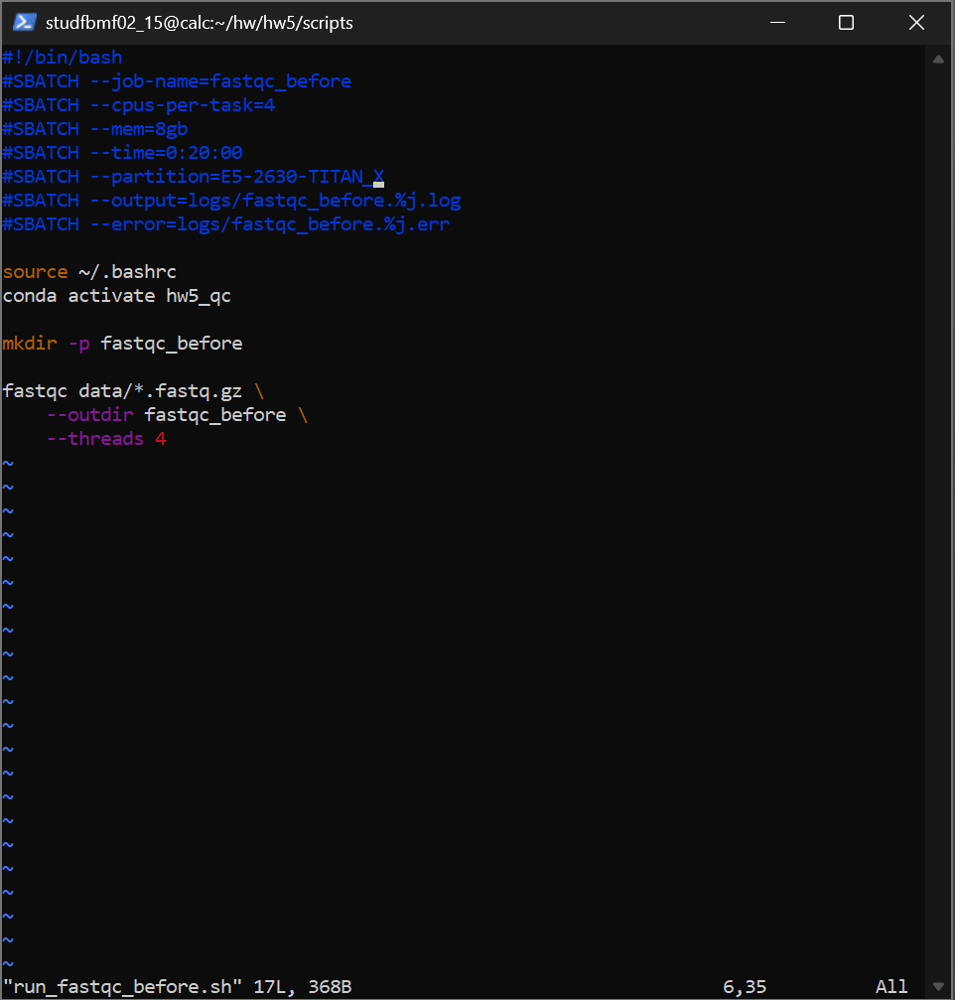

<em>Рисунок 1. SLURM-скрипт для запуска FastQC до тримминга.</em>

### Скрипт MultiQC до тримминга

  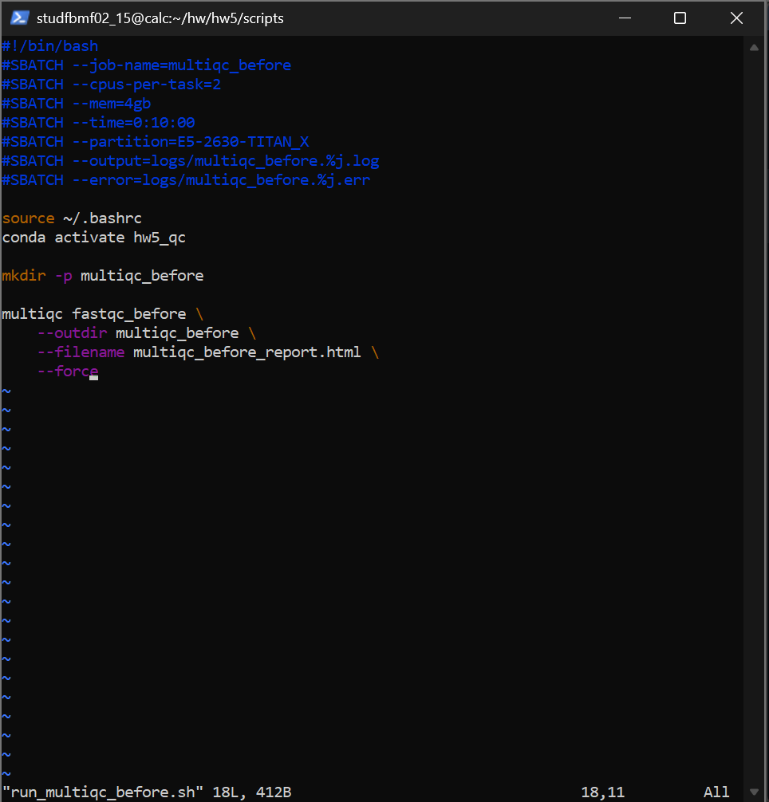

<em>Рисунок 2. SLURM-скрипт для запуска MultiQC до тримминга.</em>

### Результат

В папке fastqc_before были созданы 4 html-отчёта и 4 zip-файла, то есть по одному html и одному zip на каждый FASTQ. В результате запуска MultiQC был создан общий файл multiqc_before_report.html и папка multiqc_before_report_data.

### HTML-report. Общая статистика

В отчёте MultiQC показано 4 образца. Число ридов находится примерно от 1.1 млн до 2.0 млн. GC-состав близкий между образцами: 46–49%. По этому показателю данные выглядят согласованно. При этом уровень дупликации
сильно отличается: ERR14230600 и ERR14230602 имеют умеренную дупликацию, а ERR14230595 и ERR14230607 — заметно повышенную.

  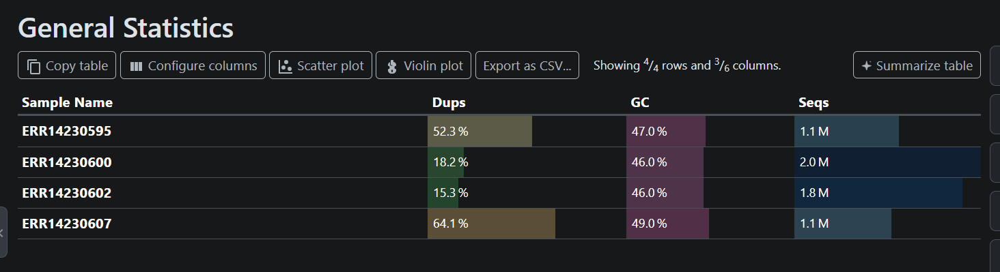

<em>Рисунок 3. General Statistics.</em>

  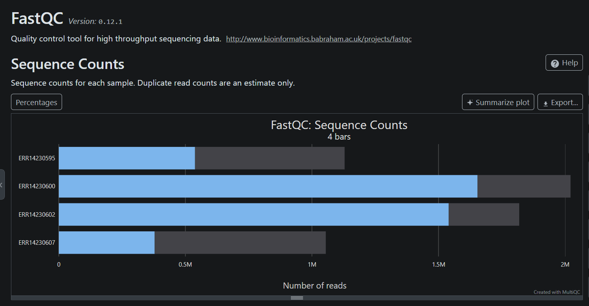

<em>Рисунок 4. Sequence Counts.</em>

### HTML-report. Качество ридов

По графику Sequence Quality Histograms качество по позициям хорошее: средний Phred score почти на всём протяжении ридов находится в зелёной зоне, примерно около Q38–Q41. На концах ридов нет падения ниже Q20. Это значит, что выраженной проблемы плохого качества на 3’-конце в этих данных не видно.

Per Sequence Quality Scores также показывает, что основная масса ридов имеет высокое среднее качество, около Q38–Q40. Отдельной большой группы ридов с низким средним качеством не наблюдается.

  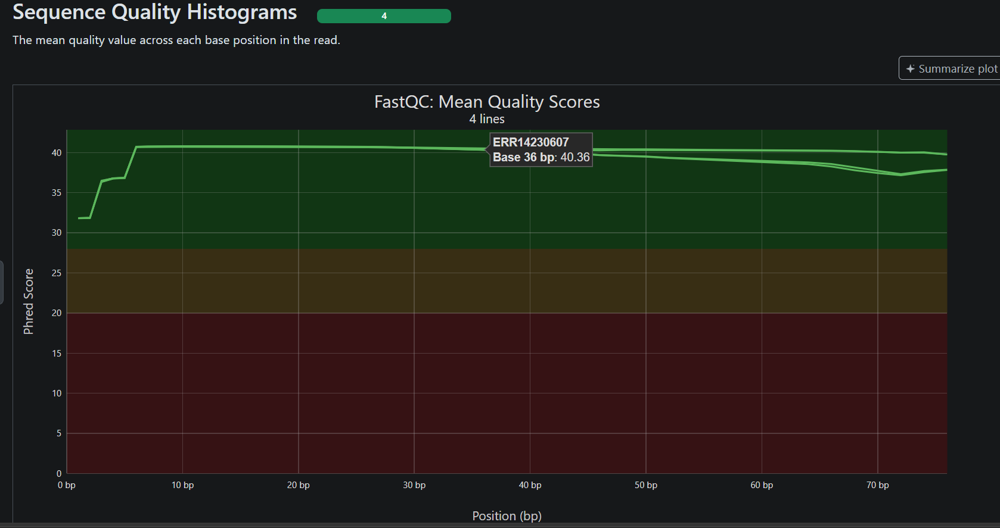

<em>Рисунок 5. Sequence Quality Histograms.</em>

  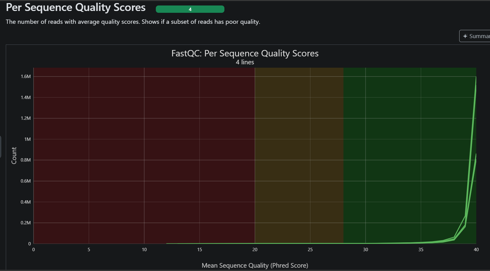

<em>Рисунок 6. Per Sequence Quality Scores.</em>

### HTML-report. N-содержание и состав оснований

Per Base N Content выглядит хорошо: доля N почти нулевая по всей длине рида. Это значит, что секвенатор почти всегда определял основание уверенно.

Per Base Sequence Content показывает, что в первых позициях ридов доли A, T, G и C распределены не совсем равномерно. Это видно по цветовым полосам в начале графика. Такое смещение может быть связано с особенностями начала чтения, подготовки библиотеки или небольшой технической погрешностью, но дальше по риду состав оснований становится более стабильным.

  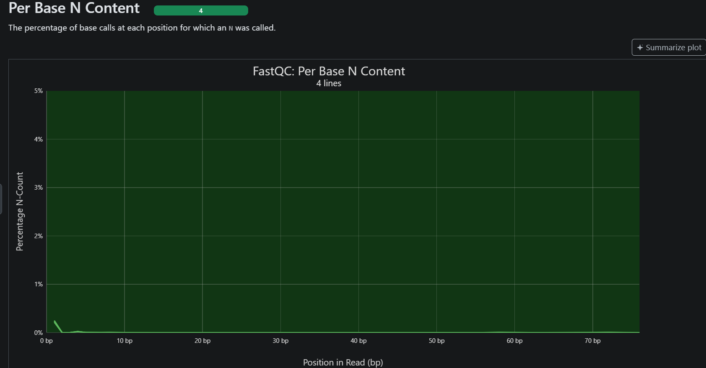

<em>Рисунок 7. Per Base N Content.</em>

  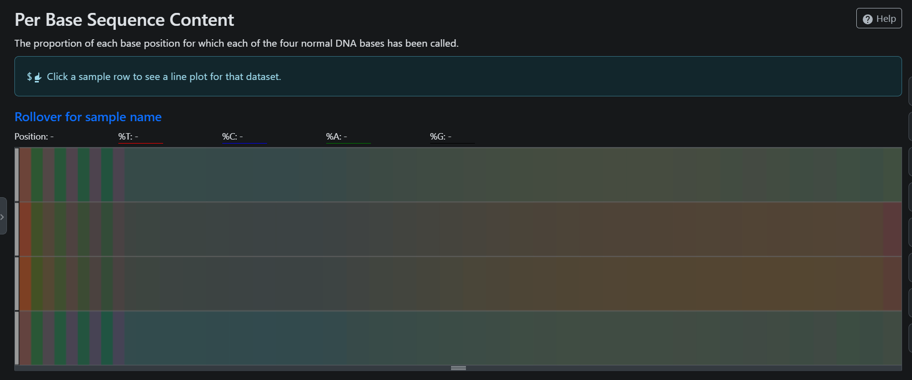

<em>Рисунок 8. Per Base Sequence Content.</em>

### HTML-report. GC-состав

Per Sequence GC Content отмечен как проблемный для части образцов. Распределение GC-состава имеет выраженный пик примерно около 46–50%. Это не связано напрямую с плохим качеством концов ридов и не исправляется обычным quality trimming. Причинами могут быть особенности библиотеки,
неслучайный набор фрагментов или смещение состава последовательностей.

  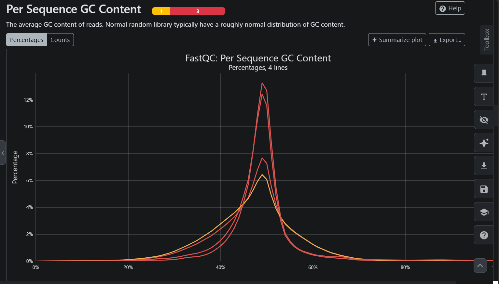

<em>Рисунок 9. Per Sequence GC Content.</em>

###  HTML-report. Длина ридов

Sequence Length Distribution показывает, что длины ридов не одинаковые: на графике виден диапазон примерно от 30 до 76 bp. Это важный пункт для следующего этапа, потому что в задании требуется отбрасывать риды короче 36 нуклеотидов после тримминга. Значит, часть коротких ридов может быть
удалена на этапе fastp.

  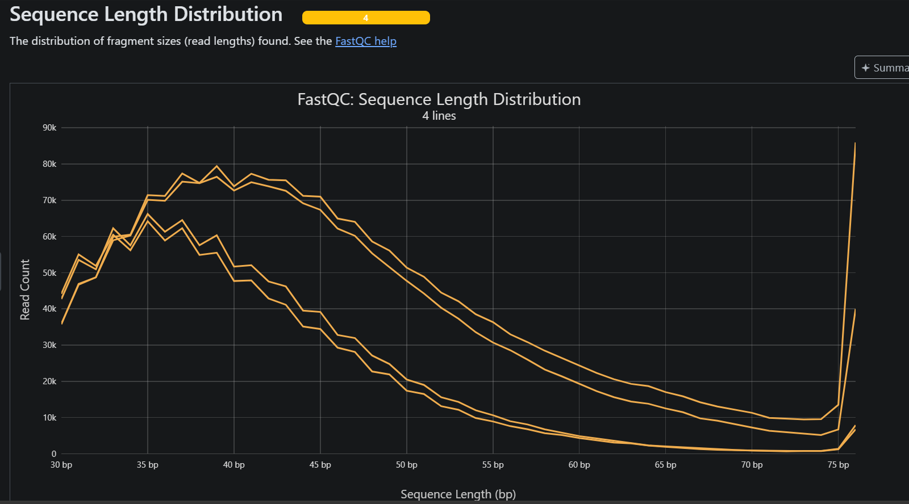

<em>Рисунок 10. Sequence Length Distribution.</em>

### HTML-report. Дупликация и сверхпредставленные последовательности

У двух образцов дупликация заметно высокая: ERR14230595 — 52.3%, ERR14230607 — 64.1%. Это может говорить о низкой сложности библиотеки, сильном обогащении отдельных последовательностей или особенностях эксперимента. Обычный тримминг по качеству не исправит такую проблему.

В разделе Overrepresented sequences видны повторяющиеся низкосложные последовательности, например с повторами TG/TGTG и CA/CACA. Они встречаются во всех четырёх отчётах, но каждая отдельная последовательность составляет меньше 1% всех ридов.

  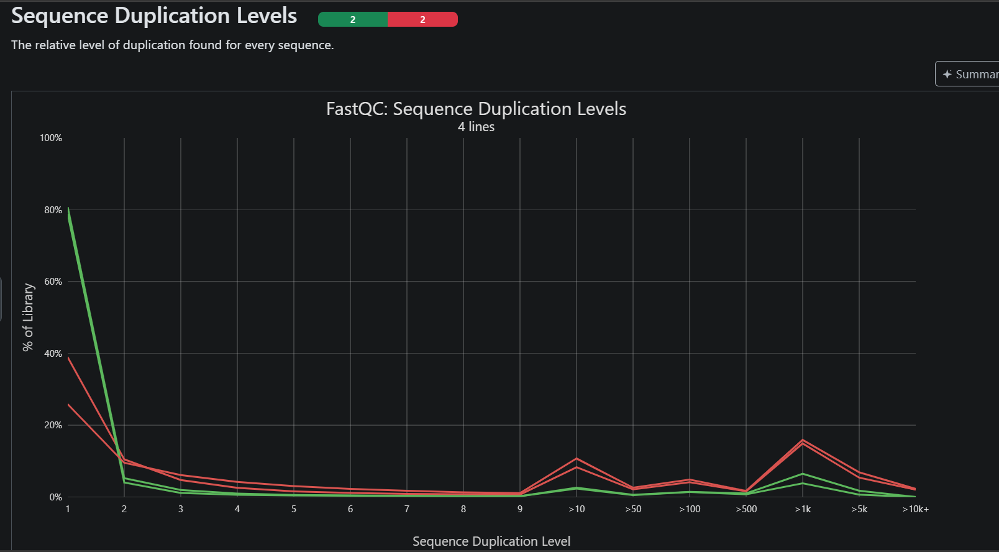

<em>Рисунок 11. Sequence Duplication Levels.</em>

  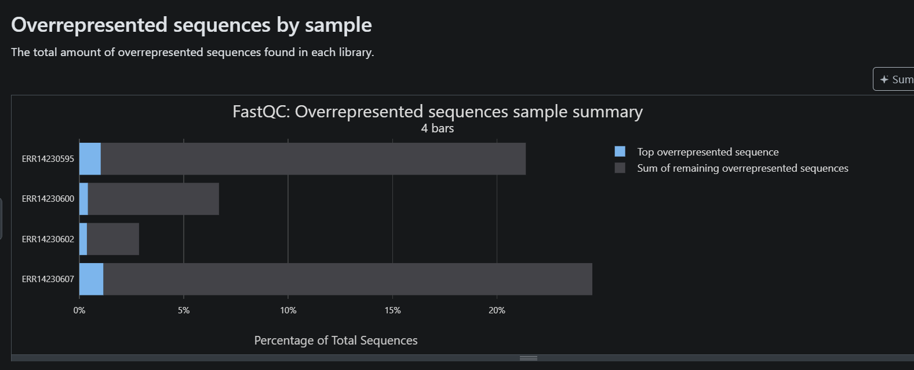

<em>Рисунок 12. Overrepresented sequences by sample.</em>

  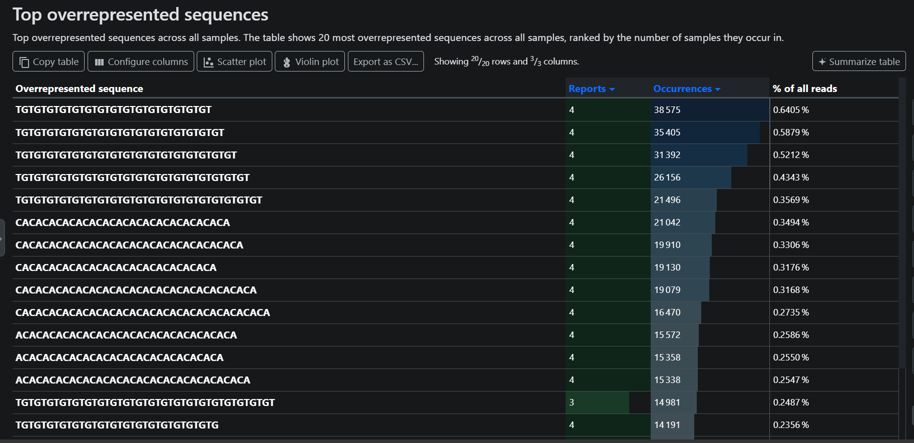

<em>Рисунок 13. Top overrepresented sequences.</em>

### HTML-report. Адаптеры

В MultiQC для Adapter Content указано, что образцов с адаптерной контаминацией выше 0.1% не найдено. Поэтому по отчёту до тримминга явных адаптеров в выбранных файлах не видно. Тем не менее, на следующем этапе fastp всё равно будет запущен с auto-detection адаптеров.

### HTML-report. Сводные статусы FastQC

В Status Checks видно, что не все разделы зелёные. Основные проблемные места: Per Sequence GC Content, Sequence Length Distribution, Sequence Duplication Levels и Overrepresented Sequences. При этом качество по
позициям, качество по ридам, N-content и Adapter Content выглядят нормально.

  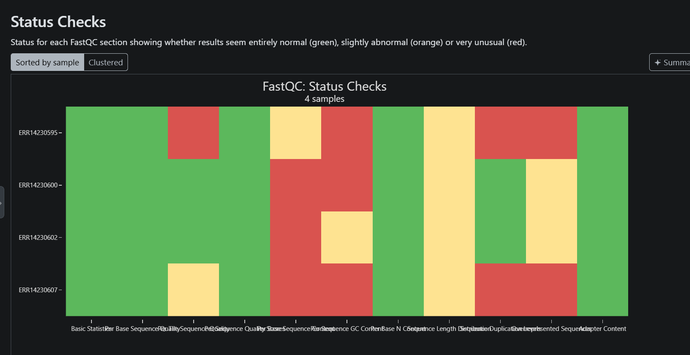

<em>Рисунок 14. Status Checks.</em>

### Выводы по первой части

- FastQC и MultiQC успешно запущены для 4 файлов из проекта PRJEB84057.

- По качеству оснований данные выглядят хорошо: сильного падения качества ниже Q20 на концах ридов не видно.

- Доля N почти нулевая, то есть проблем с неопределёнными основаниями нет.

- Явной адаптерной контаминации выше 0.1% MultiQC не показывает.

- Проблемные аспекты до тримминга: переменная длина ридов, повышенная дупликация в части образцов, сверхпредставленные низкосложные последовательности и нестандартный GC-состав.

## 7. Часть 2 — Тримминг fastp

Во второй части нужно было по результатам первого MultiQC понять, какие проблемы есть в исходных данных, а затем запустить тримминг. Я использовала fastp, потому что он умеет автоматически искать адаптеры, отрезать участки низкого качества и отбрасывать слишком короткие риды.
Для этой работы были использованы параметры из задания: окно 5 нуклеотидов, среднее качество в окне 20 и минимальная длина рида 36 нуклеотидов.

### Скрипт для fastp

  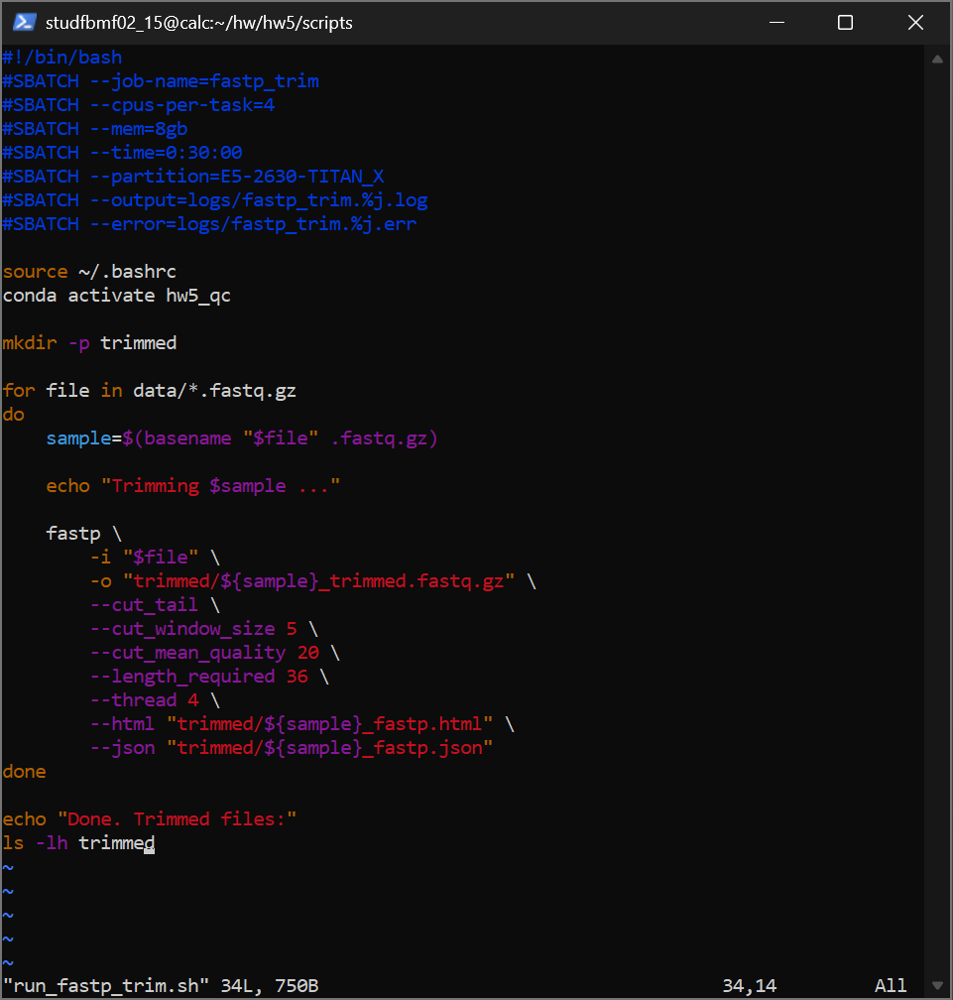

<em>Рисунок 15. Скрипт для fastp.</em>

  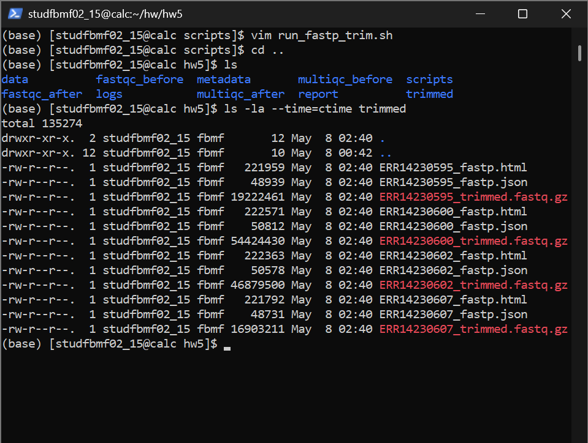

<em>Рисунок 16. Проверка созданных файлов после тримминга в папке trimmed на сервере.</em>

### Результат fastp

fastp завершился для всех четырёх файлов. Во всех образцах было написано No adapter detected for read1. Также в отчётах fastp значение reads with adapter trimmed равно 0, то есть адаптеры фактически не обрезались.

Основная причина уменьшения числа ридов — фильтр минимальной длины 36 нуклеотидов. По значением из логов fastp для каждого образца можно составить общую таблицу:

| **Образец** | **Ридов до** | **Ридов после** | **Удалено как too short** | **Удалено low quality** | **Adapter trimmed** | **N-фильтр** | **Duplication по fastp** |
|-------------|--------------|-----------------|---------------------------|-------------------------|---------------------|--------------|--------------------------|
| ERR14230595 | 1 128 748    | 794 651         | 334 022                   | 75                      | 0                   | 0            | 49.49%                   |
| ERR14230600 | 2 021 125    | 1 697 189       | 323 810                   | 126                     | 0                   | 0            | 17.67%                   |
| ERR14230602 | 1 818 383    | 1 496 873       | 321 408                   | 102                     | 0                   | 0            | 15.17%                   |
| ERR14230607 | 1 054 411    | 721 604         | 332 756                   | 51                      | 0                   | 0            | 61.09%                   |

По этой таблице видно, что low quality почти не повлиял на данные: из каждого файла удалилось только 51–126 ридов из сотен тысяч и миллионов. Зато фильтр too short удалил примерно 321–334 тыс. ридов из каждого образца. Это согласуется с первым MultiQC: до обработки в данных действительно были короткие риды.

## Часть 3 — Контроль качества после тримминга

После fastp я повторно запустила FastQC уже для файлов
`*_trimmed.fastq.gz` и снова собрала общий отчёт MultiQC.

### Скрипт FastQC после тримминга

  

<em>Рисунок 17. SLURM-скрипт для запуска FastQC после тримминга.</em>

FastQC после тримминга создал 4 html-файла и 4 zip-файла, то есть по одному отчёту на каждый очищенный FASTQ-файл.

### Скрипт MultiQC после тримминга

  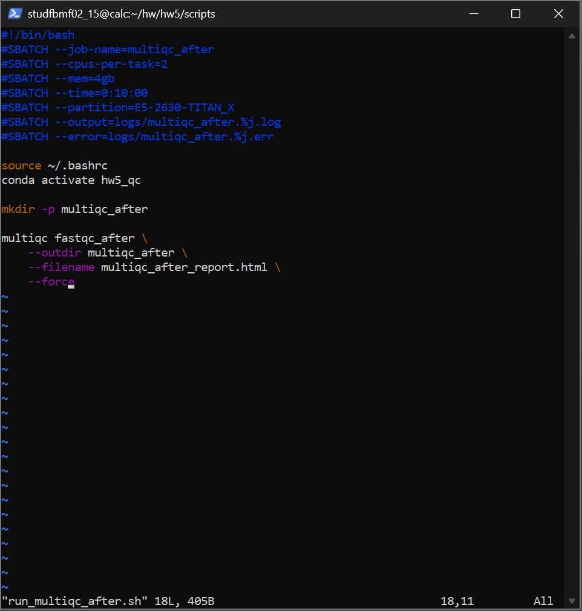

<em>Рисунок 18. SLURM-скрипт для запуска MultiQC после тримминга.</em>

MultiQC после тримминга завершился и создал файл
multiqc_after_report.html, а также папку multiqc_after_report_data.

### HTML-report. Общая статистика после тримминга

  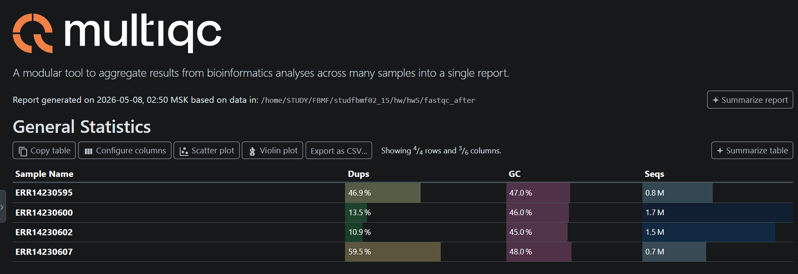

<em>Рисунок 19. General Statistics после тримминга.</em>

  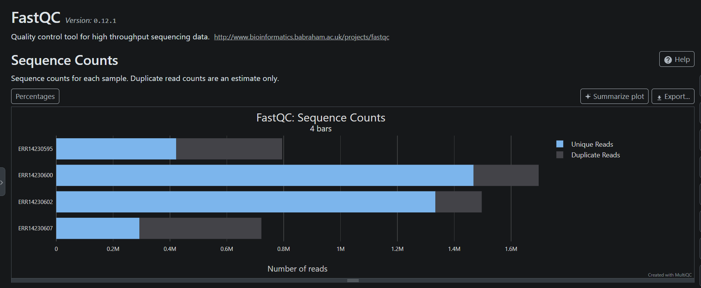

<em>Рисунок 20. Sequence Counts после тримминга.</em>

После тримминга число ридов уменьшилось, что ожидаемо: часть коротких ридов была удалена. GC-состав почти не изменился, значит fastp не менял общую композицию данных. Дупликация немного снизилась во всех четырёх образцах, но в ERR14230595 и ERR14230607 она всё равно остаётся высокой.

### HTML-report. Качество ридов после тримминга

  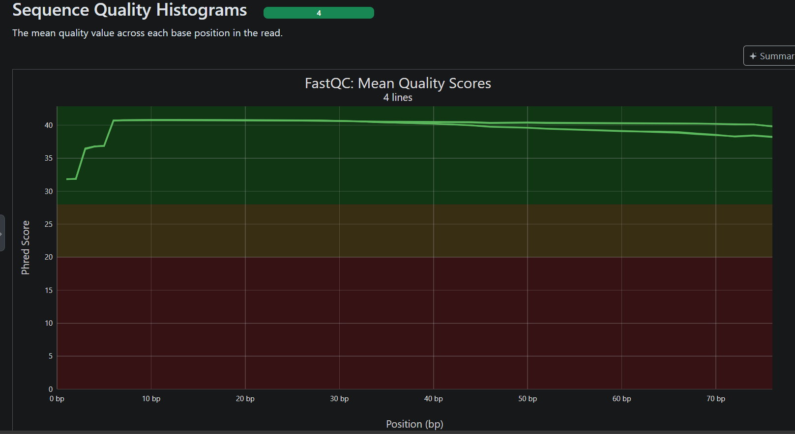

<em>Рисунок 21. Sequence Quality Histograms после тримминга.</em>

  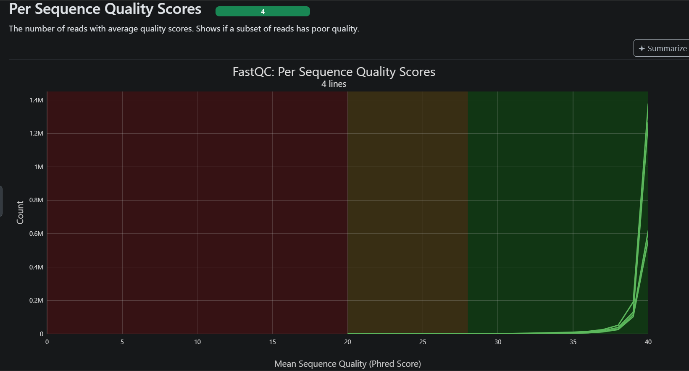

<em>Рисунок 22. Per Sequence Quality Scores после тримминга.</em>

Качество по позициям после тримминга осталось высоким: почти все значения находятся в зелёной зоне. Сильного падения качества на конце ридов не видно. По сути, здесь не произошло резкого улучшения, потому что исходные данные уже были хорошими по качеству. При этом небольшое улучшение Q40 видно в логах fastp: например, доля Q40 после фильтрации немного увеличилась у всех образцов.

### HTML-report. Состав оснований, GC и N после тримминга

  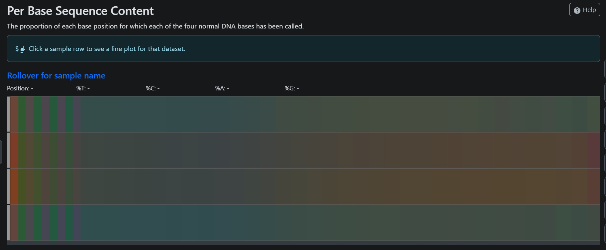

<em>Рисунок 23. Per Base Sequence Content после тримминга.</em>

  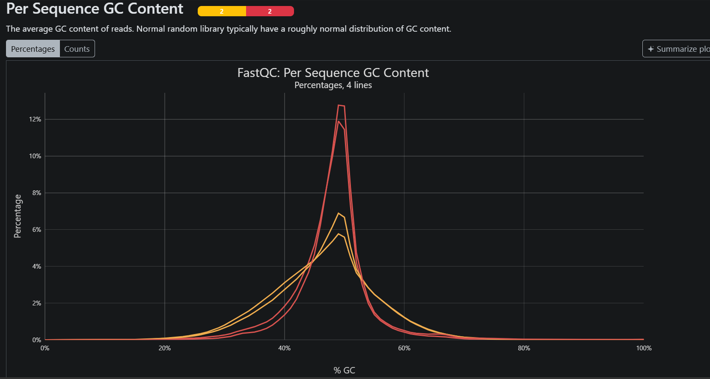

<em>Рисунок 24. Per Sequence GC Content после тримминга.</em>

  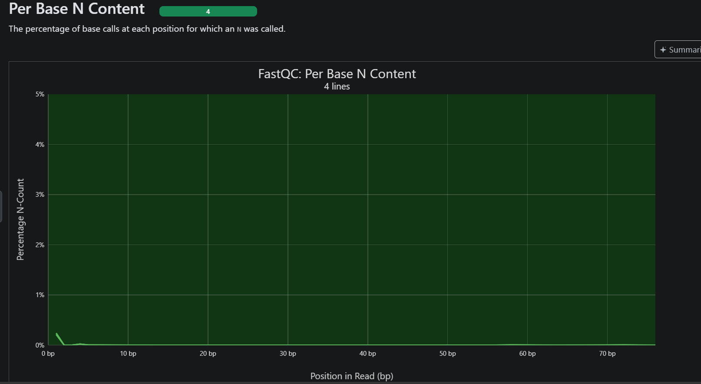

<em>Рисунок 25. Per Base N Content после тримминга.</em>

Доля N после тримминга остаётся почти нулевой, то есть с неопределёнными основаниями проблем нет. GC-состав после обработки остался примерно таким же, как до обработки. Это логично, потому что GC-состав связан скорее с самой библиотекой и набором последовательностей, а не с
низкокачественным концом рида. Смещение состава оснований в начале ридов также полностью не исчезло, поэтому это, скорее всего, особенность библиотеки или подготовки данных, а не проблема, которую должен исправить обычный quality trimming.

### HTML-report. Длина ридов, дупликация и сверхпредставленные последовательности

  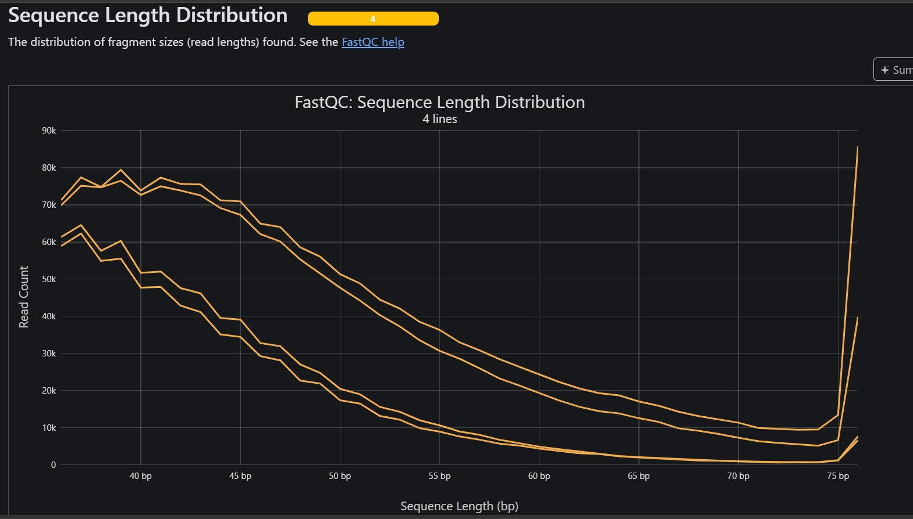

<em>Рисунок 26. Sequence Length Distribution после тримминга.</em>

  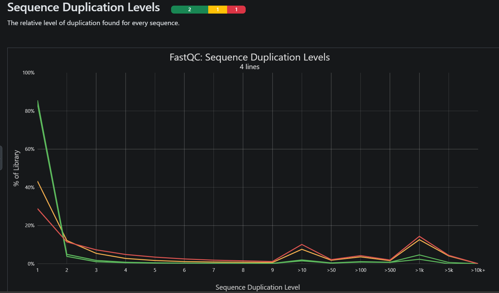

<em>Рисунок 27. Sequence Duplication Levels после тримминга.</em>

  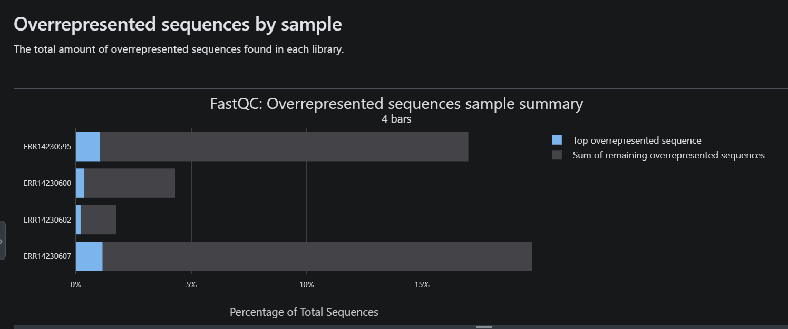

<em>Рисунок 28. Overrepresented sequences by sample после тримминга.</em>

  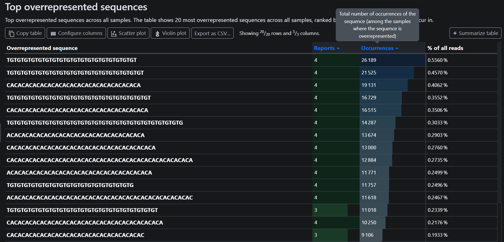

<em>Рисунок 29. Top overrepresented sequences после тримминга.</em>

После fastp короткие риды меньше 36 нуклеотидов были удалены, поэтому нижняя граница распределения длин сдвинулась к 36 bp. Однако распределение длин всё равно осталось неравномерным, поэтому FastQC продолжает отмечать этот раздел как предупреждение. Дупликация снизилась, но не исчезла. Особенно это видно для ERR14230595 и
ERR14230607: после обработки дупликация всё ещё около 46.9% и 59.5%. Сверхпредставленные последовательности также остаются, в основном это повторы вида TG/TGTG и CA/CACA. Такие последовательности больше похожи на низкосложные повторы, а не на адаптеры.

### HTML-report. Адаптеры и итоговые статусы после тримминга

  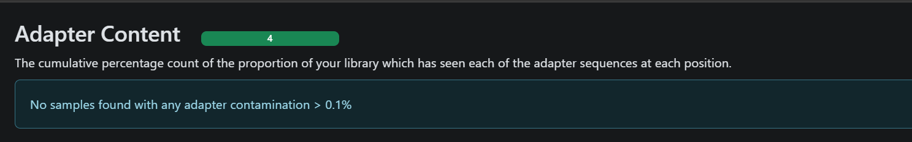

<em>Рисунок 30. Adapter Content после тримминга.</em>

  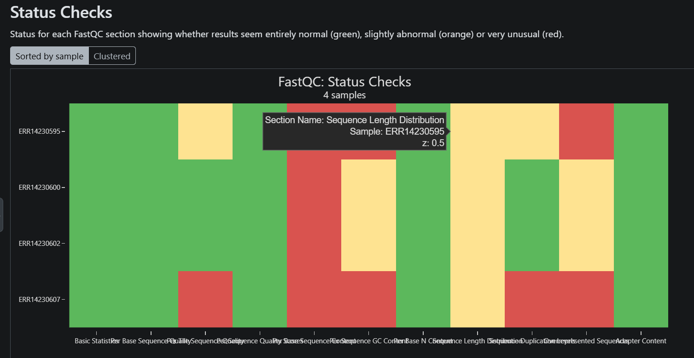

<em>Рисунок 31. Status Checks после тримминга.</em>

В разделе Adapter Content после тримминга снова указано, что образцов с адаптерной контаминацией выше 0.1% не найдено. Это совпадает с логами fastp: No adapter detected for read1 и reads with adapter trimmed = 0.

По итоговой таблице статусов видно, что часть проблем осталась: GC-состав, длины ридов, дупликация и сверхпредставленные последовательности. При этом качество по позициям, качество по ридам, N-content и адаптеры выглядят нормально.

## Итоговое сравнение до и после тримминга

- Адаптеры: не обнаружены ни до, ни после. fastp тоже не нашёл адаптеры и ничего не обрезал по адаптерам.

- Качество: было хорошим уже до обработки и осталось хорошим после обработки, есть небольшое улучшение по Q40.

- Короткие риды: это главный эффект fastp. Фильтр --length_required 36 удалил много коротких ридов.

- N-содержание: проблем не было, после обработки доля N также почти нулевая.

- Дупликация: немного снизилась, но у двух образцов всё ещё высокая, т.к. это не решается обычным триммингом.

- GC-состав и сверхпредставленные последовательности: в целом остались, то есть это скорее связано с составом библиотеки, а не с плохими концами ридов или адаптерами.

## Итоговые выводы

В работе были выбраны и скачаны 4 single-end FASTQ-файла из проекта PRJEB84057. Для исходных данных был выполнен FastQC, после чего отдельные отчёты были объединены в общий отчёт MultiQC. По первому отчёту было видно, что явной адаптерной контаминации и сильного падения качества на концах ридов нет. Основные проблемы данных были связаны не с плохим качеством чтения, а с переменной длиной ридов, дупликацией, особенностями GC-состава и сверхпредставленными низкосложными последовательностями.

Во второй части был выполнен тримминг с помощью fastp. Использовались auto-detection адаптеров, параметр `--cut_tail`, окно 5, среднее качество 20 и минимальная длина 36 bp. fastp не обнаружил адаптеры, поэтому обрезка адаптеров фактически не выполнялась. Основная фильтрация произошла из-за коротких ридов: после обработки были удалены риды, которые оказались короче 36 bp, а удаление по низкому качеству и по N было минимальным.

После тримминга был повторно запущен FastQC и снова собран отчёт MultiQC. Сравнение до и после показало, что качество ридов осталось хорошим, а короткие риды были отфильтрованы. При этом дупликация, GC-смещение и сверхпредставленные повторы полностью не исчезли. Это логично, потому что такие признаки скорее связаны с особенностями библиотеки или эксперимента, а не с качеством концов ридов.

Итог: тримминг был полезен для удаления слишком коротких ридов, но не все нестандартные признаки данных можно исправить триммингом. Часть из них, скорее всего, связана с особенностями библиотеки или эксперимента.
