# Отчёт по дз6

Был выполнен анализ RNA-seq данных: сначала контроль качества исходных paired-end ридов через FastQC и MultiQC, затем тримминг через fastp, повторный контроль качества, выравнивание на референсный геном GRCh38 с помощью STAR, сборка транскриптов через StringTie и подсчёт каунтов генов через HTSeq-count. В конце были сравнены каунты из STAR `RNA_ReadsPerGene.out.tab` и HTSeq-count, построен scatter plot и посчитана корреляция.

---

## Задачи:

1) Запустить FastQC для исходных файлов `Eg_Treg_S71_R1_001.fastq.gz` и `Eg_Treg_S71_R2_001.fastq.gz`;
2) Собрать общий отчёт MultiQC для исходных данных;
3) По отчёту определить проблемные места: адаптеры, плохое качество на концах ридов, GC-состав, дупликацию и сверхпредставленные последовательности;
4) Выполнить тримминг paired-end ридов через fastp;
5) Повторно запустить FastQC и MultiQC для триммированных ридов и сравнить результаты до и после обработки;
6) Выровнять триммированные риды на референсный геном GRCh38 с помощью STAR;
7) Получить BAM-файл и STAR GeneCounts;
8) Собрать транскрипты через StringTie в режиме de novo;
9) Посчитать gene counts через HTSeq-count;
10) Сравнить STAR counts из `RNA_ReadsPerGene.out.tab` с HTSeq-count и построить scatter plot;
11) Сделать выводы

---

## Часть 1 — Анализ FastQC до тримминга

В первой части были взяты два исходных FASTQ-файла:

```text
/home/STUDY/FBMF/bioinformatics/rnaseq_map_star/raw_data/Eg_Treg_S71_R1_001.fastq.gz
/home/STUDY/FBMF/bioinformatics/rnaseq_map_star/raw_data/Eg_Treg_S71_R2_001.fastq.gz
```

Для них был запущен FastQC, после чего результаты были объединены в общий отчёт MultiQC. Еще была создана отдельная conda-среда `hw6_qc`, куда были установлены `fastqc`, `multiqc` и `fastp`.

### Скрипт FastQC + MultiQC для исходных данных

<p align="center">
  
</p>


### HTML-report. Общая статистика до тримминга

MultiQC показывает два образца: `Eg_Treg_S71_R1_001` и `Eg_Treg_S71_R2_001`. В каждом файле примерно по **19.8 млн ридов**. GC-состав близкий: **45.0%** для R1 и **46.0%** для R2. Дупликация составляет **27.7%** для R1 и **21.2%** для R2.

<p align="center">
  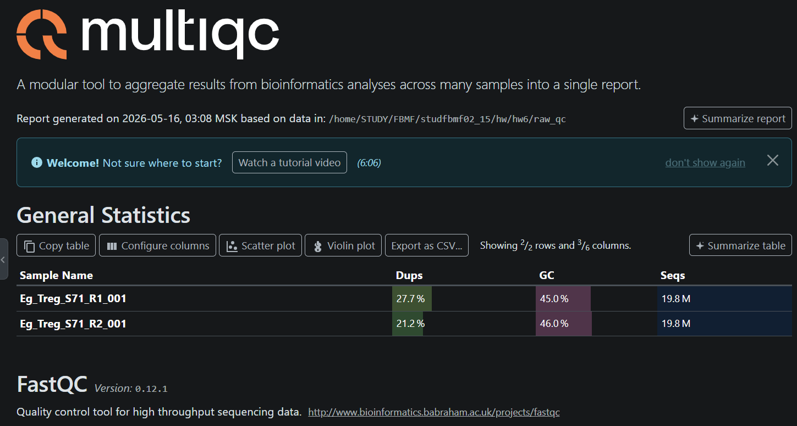
</p>

<p align="center"><em>Рисунок 1. General Statistics до тримминга.</em></p>

<p align="center">
  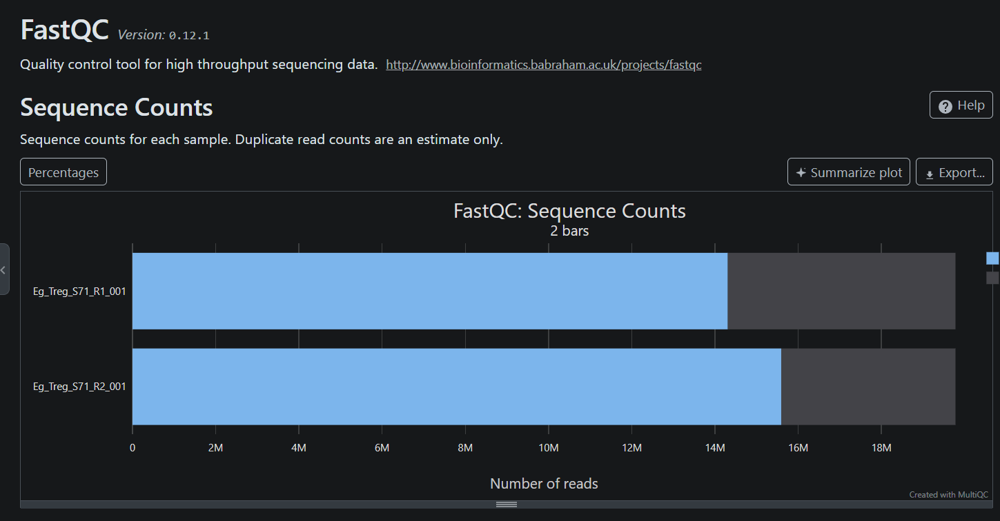
</p>

<p align="center"><em>Рисунок 2. Sequence Counts до тримминга.</em></p>

### HTML-report. Качество ридов до тримминга

По графику Sequence Quality Histograms качество по позициям хорошее. Средний Phred score почти по всей длине ридов находится в зелёной зоне и держится сильно выше Q30. В конце ридов нет падения качества ниже Q20, поэтому выраженной проблемы плохого качества на концах ридов не видно.

<p align="center">
  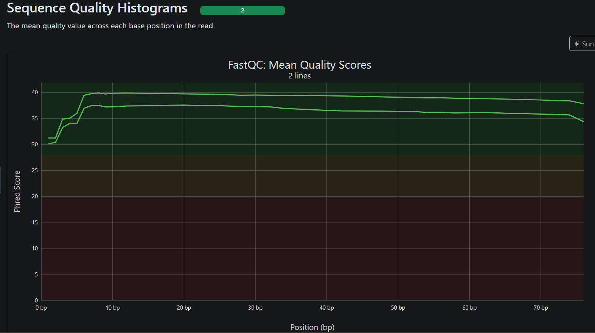
</p>

<p align="center"><em>Рисунок 3. Sequence Quality Histograms до тримминга.</em></p>

### HTML-report. GC-состав до тримминга

GC-состав отмечен как проблемный или предупреждающий пункт. Распределение GC не выглядит как простое нормальное распределение: есть основной пик примерно в районе 40–50% GC и дополнительное смещение. Это может быть связано с особенностями RNA-seq библиотеки, поэтому обычный тримминг по качеству такую проблему исправить не должен.

<p align="center">
  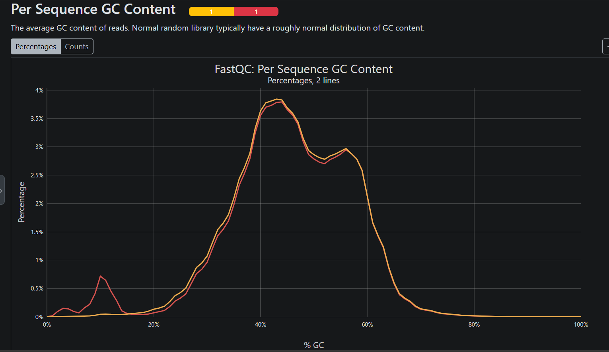
</p>

<p align="center"><em>Рисунок 4. Per Sequence GC Content до тримминга.</em></p>

### HTML-report. Дупликация, адаптеры и сверхпредставленные последовательности

В исходных данных есть умеренная дупликация: R1 — 27.7%, R2 — 21.2%. Для RNA-seq это не обязательно ошибка, потому что часть транскриптов может быть сильно экспрессирована и поэтому часто встречаться в ридах. Тем не менее повышенная дупликация показывает, что библиотека не полностью равномерная.

В разделе Overrepresented sequences видны последовательности с длинными poly-T участками. В Adapter Content адаптерная контаминация небольшая, но к концу ридов заметна. Поэтому тримминг был оправдан, хотя исходное качество оснований уже было хорошим.

### HTML-report. Сводные статусы FastQC до тримминга

По Status Checks видно, что основные проблемные места до тримминга — это Per Sequence GC Content, Overrepresented Sequences и Adapter Content. При этом качество по позициям, качество по ридам и N-content выглядят хорошо.

<p align="center">
  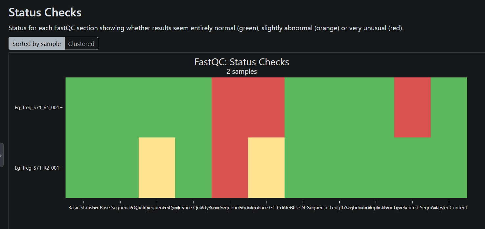
</p>

<p align="center"><em>Рисунок 5. Status Checks до тримминга.</em></p>

### Результаты части 1

- FastQC и MultiQC успешно запущены для двух paired-end FASTQ-файлов.
- В каждом файле примерно по **19.8 млн ридов**.
- Качество по позициям хорошее: выраженного падения ниже Q20 на концах нет.
- Доля N почти нулевая.
- Есть небольшая адаптерная/техническая контаминация ближе к концам ридов.
- Есть сверхпредставленные poly-T последовательности.
- GC-состав нестандартный и триммингом не исправится.
- Тримминг нужен для удаления адаптерных хвостов и слабых/коротких ридов.

---

## Часть 2 — Тримминг fastp

Во второй части был выполнен тримминг через fastp. Я использовала fastp, потому что он умеет автоматически искать адаптеры, отрезать участки низкого качества и отбрасывать слишком короткие риды.

### Скрипт fastp + FastQC + MultiQC после тримминга

<p align="center">
  
</p>

<p align="center">
  
</p>

### Результат fastp

По отчёту fastp видно, что до фильтрации было **39.55886 млн reads**, после фильтрации осталось **37.863790 млн reads**. То есть прошло фильтры примерно **95.7%** ридов. Средняя длина ридов уменьшилась с **76 bp** до **74 bp**, значит тримминг не обрезал данные слишком сильно.

<p align="center">
  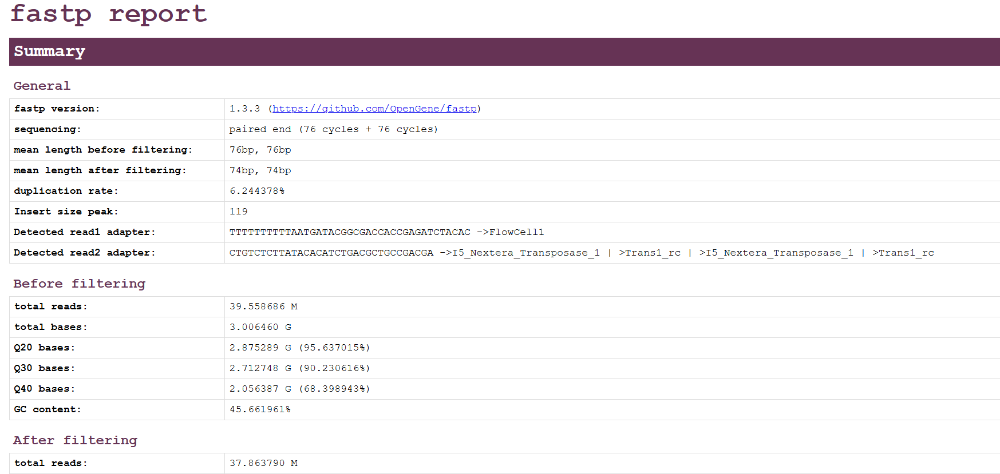
</p>

<p align="center"><em>Рисунок 6. Результаты fastp 1.</em></p>

<p align="center">
  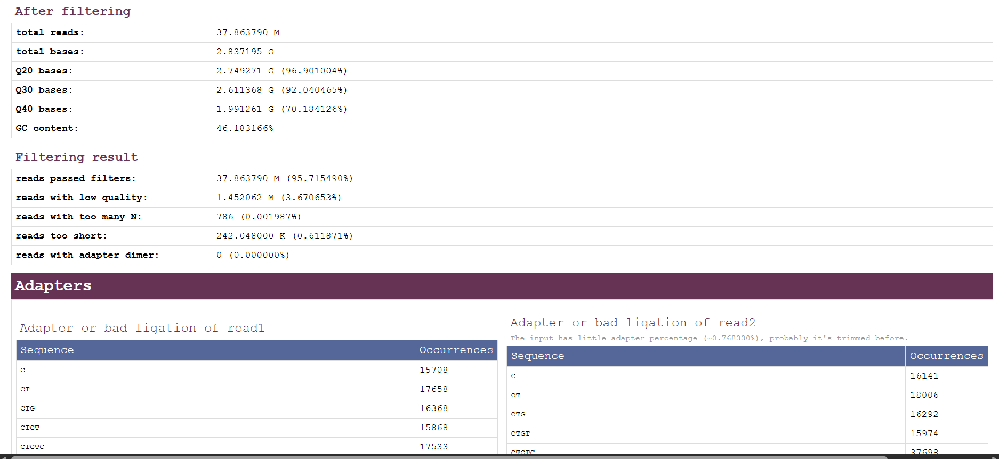
</p>

<p align="center"><em>Рисунок 7. Результаты fastp 2.</em></p>

Основные показатели качества по fastp:

| Показатель | До фильтрации | После фильтрации |
|---|---:|---:|
| Total reads | 39.55886 M | 37.863790 M |
| Total bases | 3.006460 G | 2.837195 G |
| Q20 bases | 95.637015% | 96.900100% |
| Q30 bases | 90.230616% | 92.040465% |
| Q40 bases | 68.39843% | 70.184126% |
| GC content | 45.61961% | 46.18316% |
| Mean length | 76 bp / 76 bp | 74 bp / 74 bp |

Основная причина удаления ридов — низкое качество части последовательностей: **1.452062 млн reads** или **3.67%**. Слишком коротких ридов было **242.480 тыс.**, то есть **0.61%**. Ридов с большим количеством N почти не было: всего **786**. Также fastp обнаружил адаптерные/технические последовательности для read1 и read2.

---

## Часть 3 — Контроль качества после тримминга

После fastp был повторно запущен FastQC для файлов:

```text
trimmed_data/Eg_Treg_S71_R1_trimmed.fastq.gz
trimmed_data/Eg_Treg_S71_R2_trimmed.fastq.gz
```

После этого отчёты были объединены через MultiQC.

### HTML-report. Общая статистика после тримминга

После тримминга осталось примерно по **18.9 млн ридов** в R1 и R2. GC-состав почти не изменился: около **45.0%** для R1 и **46.0%** для R2. Дупликация стала **26.1%** для R1 и **21.7%** для R2. То есть сильного изменения GC и дупликации не произошло.

<p align="center">
  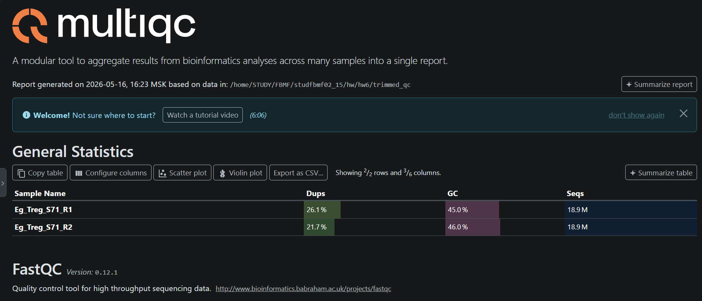
</p>

<p align="center"><em>Рисунок 8. General Statistics после тримминга.</em></p>

<p align="center">
  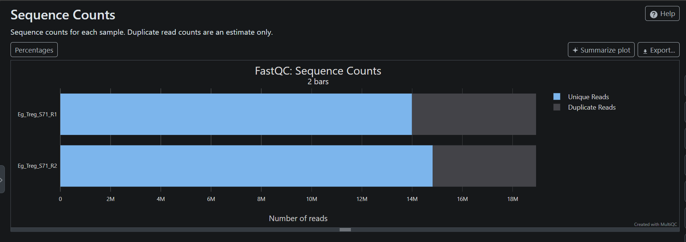
</p>

<p align="center"><em>Рисунок 9. Sequence Counts после тримминга.</em></p>

### HTML-report. Качество ридов после тримминга

Качество по позициям после обработки осталось высоким. По графику видно, что средние значения Phred score всё ещё находятся в зелёной зоне. Значимого падения качества на концах не видно. Небольшое улучшение видно по fastp-метрикам: Q30 вырос с **90.23%** до **92.04%**, Q20 — с **95.64%** до **96.90%**.

<p align="center">
  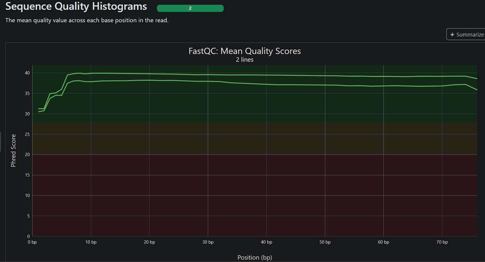
</p>

<p align="center"><em>Рисунок 10. Sequence Quality Histograms после тримминга.</em></p>

### HTML-report. GC-состав после тримминга

GC-состав после обработки остался примерно таким же, как до тримминга, поэтому продолжает отмечаться красным цветом. Можем сделать вывод, что GC-состав связан с особенностями библиотеки и набора транскриптов, а не с плохими концами ридов.

<p align="center">
  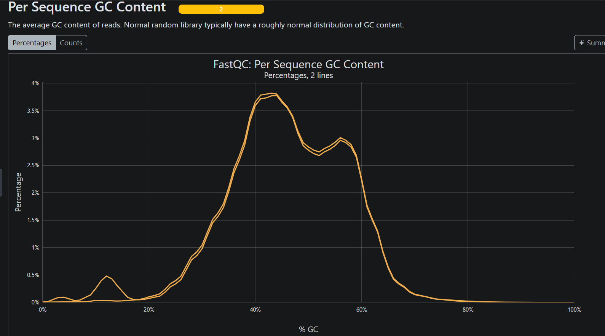
</p>

<p align="center"><em>Рисунок 11. Per Sequence GC Content после тримминга.</em></p>

### HTML-report. Адаптеры и сверхпредставленные последовательности после тримминга

После тримминга адаптерный сигнал стал слабее. В Adapter Content остались только низкие значения, а общий статус по адаптерам стал нормальным. Сверхпредставленные poly-T последовательности полностью не исчезли, но их доля уменьшилась: например, самая частая последовательность составляет около **0.38%** всех ридов после обработки.

<p align="center">
  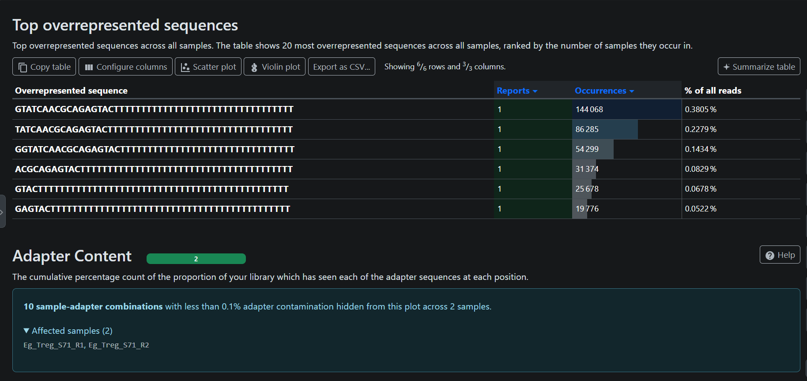
</p>

<p align="center"><em>Рисунок 12. Сверхпредставленные последовательности и Adapter Content после тримминга.</em></p>

<p align="center">
  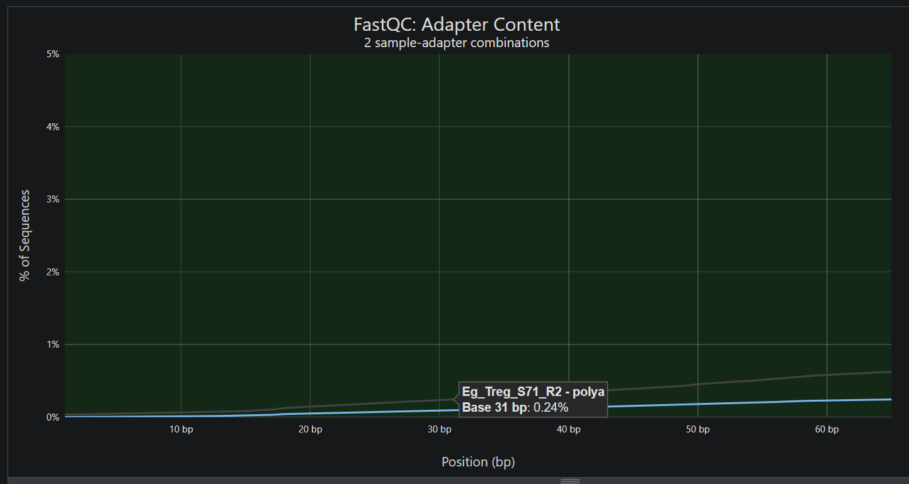
</p>

<p align="center"><em>Рисунок 13. Adapter Content после тримминга.</em></p>

### HTML-report. Сводные статусы после тримминга

После тримминга качество, N-content, дупликация и адаптеры выглядят приемлемо. При этом GC-состав и распределение длин всё ещё отмечены предупреждениями, т.к. после тримминга длины не становятся строго одинаковыми, а GC-состав не обязан исправляться обработкой концов ридов.

<p align="center">
  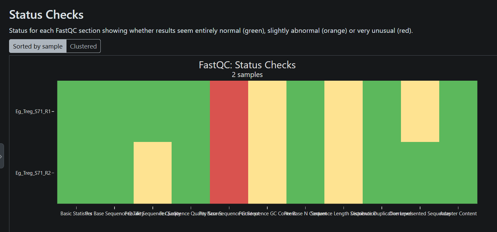
</p>

<p align="center"><em>Рисунок 14. Status Checks после тримминга.</em></p>

### Итоговое сравнение до и после тримминга

- Адаптеры: до тримминга была небольшая адаптерная контаминация, после fastp она стала слабее.
- Качество: качество было хорошим уже до обработки, но после fastp немного улучшились Q20/Q30/Q40.
- Короткие и слабые риды: часть ридов была удалена, всего сохранилось около **95.7%** данных.
- N-содержание: проблем почти не было ни до, ни после.
- GC-состав: почти не изменился, потому что это особенность библиотеки, а не плохих концов ридов.
- Сверхпредставленные последовательности: poly-T последовательности остались, но их доля уменьшилась.

---

## Часть 4 — Выравнивание на референсный геном STAR

В папке bioinformatics/GRCh38 были найдены основные файлы STAR: `Genome`, `SA`, `SAindex`, `chrName.txt`, `chrLength.txt`, `chrStart.txt`, а также GTF-файл `Homo_sapiens.GRCh38.110.chr.gtf`.

### Скрипт STAR

<p align="center">
  
</p>

### Результаты STAR

<p align="center">
  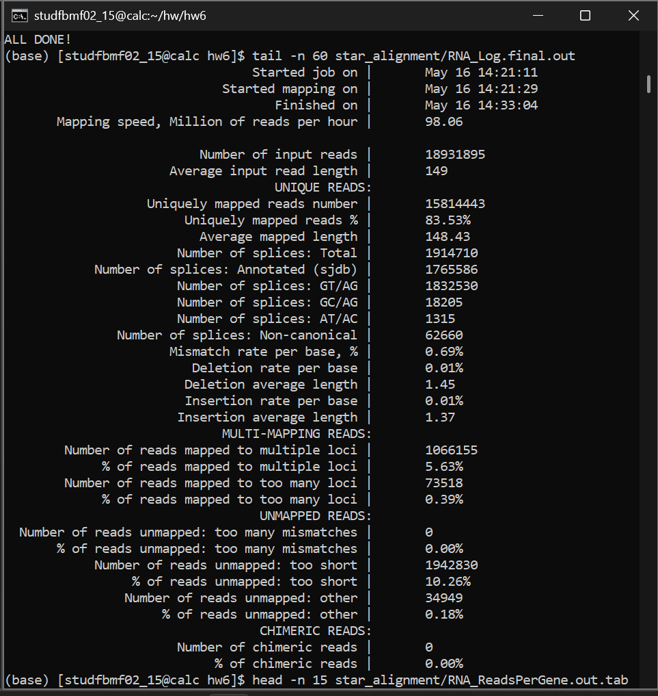
</p>

<p align="center"><em>Рисунок 15. Финальная статистика STAR.</em></p>

Уникальное выравнивание **83.53%** — хороший результат для RNA-seq данных. Основная категория невыравненных ридов — `too short`, около **10.26%**.

## Часть 5 — Сборка транскриптов StringTie

StringTie был запущен на BAM-файле, полученном после STAR. Нужно было получить собственную модель транскриптов, поэтому StringTie был запущен без `-G`, то есть в режиме de novo.

### Скрипт StringTie

<p align="center">
  
</p>

### Результат StringTie

StringTie успешно создал файл transcripts.gtf, размер файла составил около **25M**.

<p align="center">
  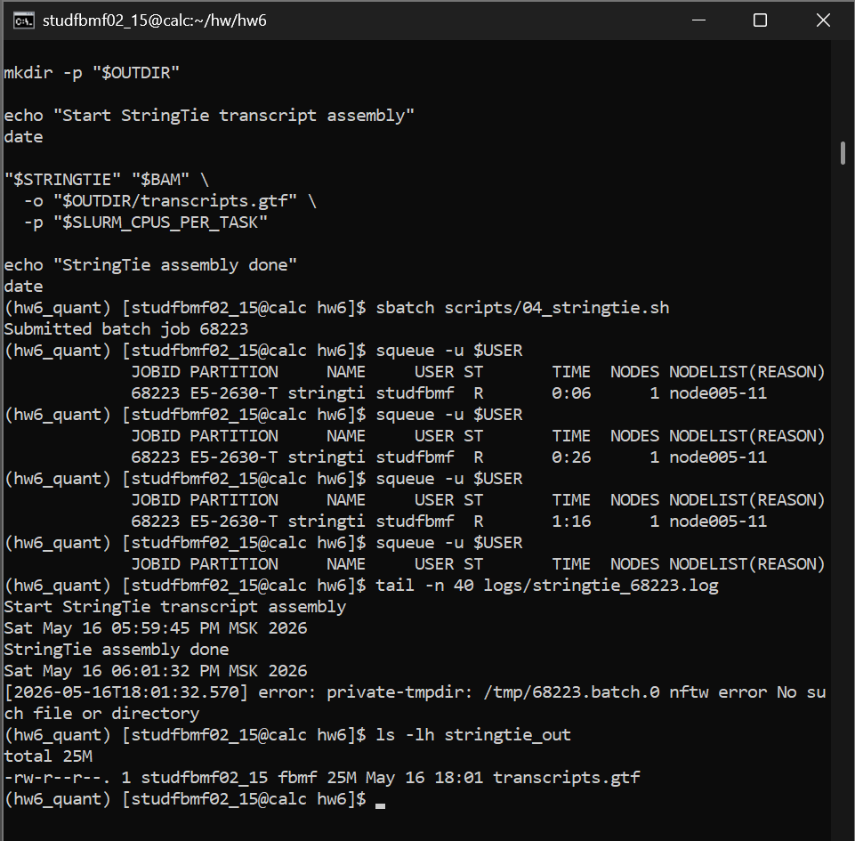
</p>

<p align="center"><em>Рисунок 16. Завершение StringTie и создание transcripts.gtf.</em></p>

Первые строки GTF показывают стандартную структуру файла: chromosome, source, feature type, start, end, score, strand, frame, attributes. В attributes указаны `gene_id`, `transcript_id`, `cov`, `FPKM`, `TPM`.

<p align="center">
  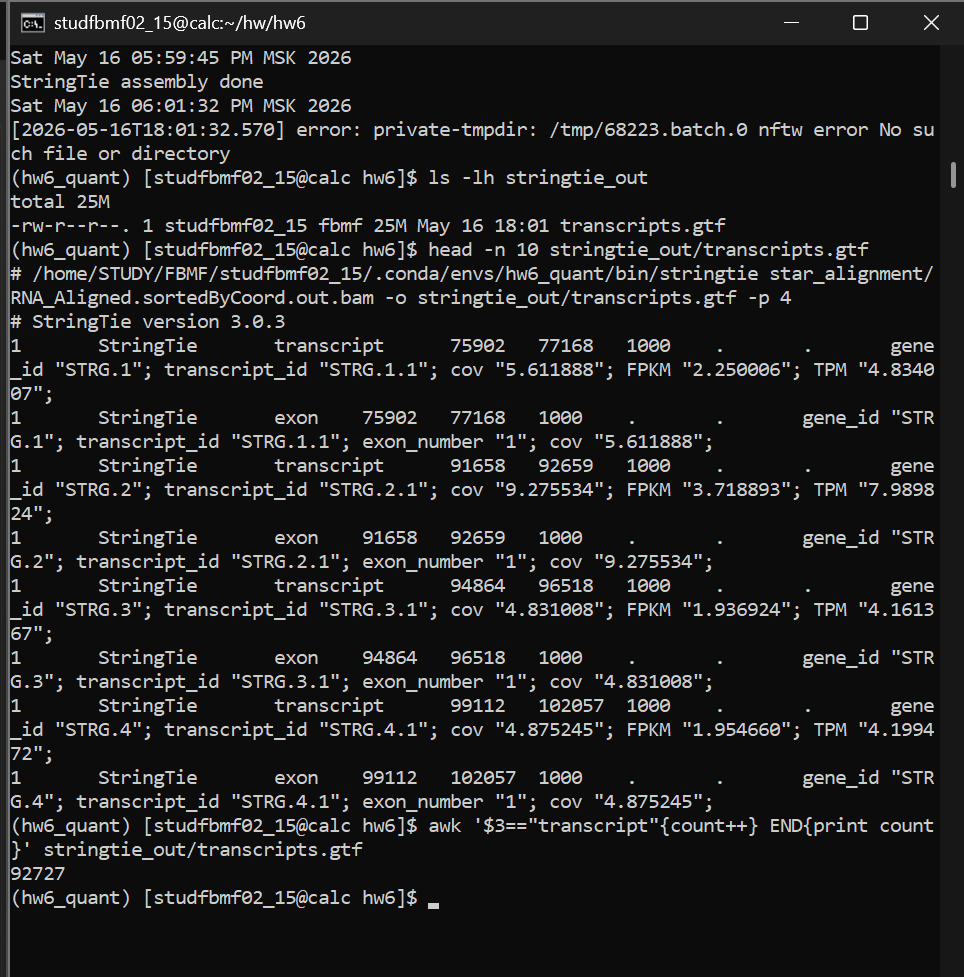
</p>

<p align="center"><em>Рисунок 17. Первые строки файла transcripts.gtf и подсчёт транскриптов.</em></p>

Количество собранных транскриптов было посчитано по строкам с feature type `transcript`. StringTie собрал **9727 транскриптов**.

## Часть 6 — Подсчёт генов через HTSeq-count

Для HTSeq-count использовался отсортированный BAM от STAR и GRCh38.

### Скрипт HTSeq-count

<p align="center">
  
</p>

### Результат HTSeq-count

В логе было предупреждение о **276 mate records missing**, но на фоне примерно **16.88 млн** обработанных пар это небольшое предупреждение, и подсчёт завершился нормально.

<p align="center">
  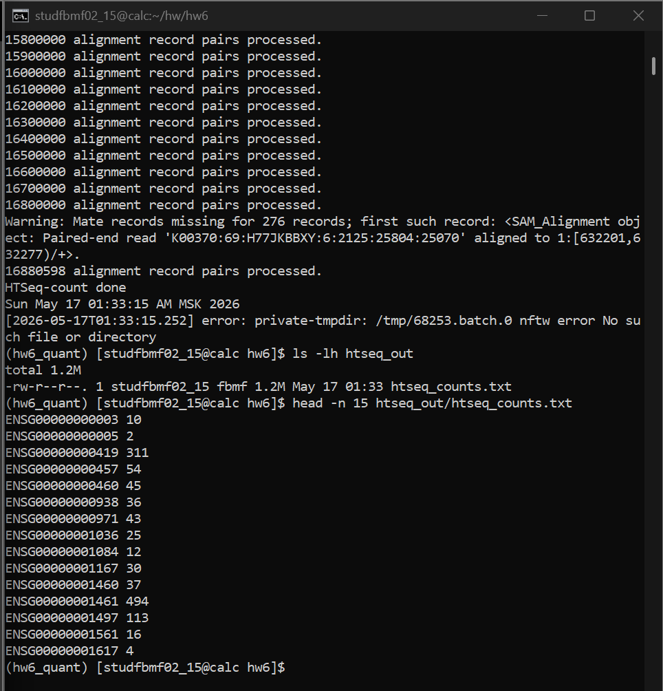
</p>

<p align="center"><em>Рисунок 18. Результат HTSeq-count и первые строки htseq_counts.txt.</em></p>

Количество генов в `htseq_counts.txt` без служебных строк `__...`: 62700.

В конце файла HTSeq также вывел служебные категории:

```text
__no_feature              12083374
__ambiguous               619315
__too_low_aQual           0
__not_aligned             0
__alignment_not_unique    1066155
```

Это означает, что часть ридов не попала в гены аннотации (`__no_feature`), часть попала в неоднозначные области (`__ambiguous`), а часть относилась к неуникальным выравниваниям (`__alignment_not_unique`).

---

## Часть 7 — Сравнение STAR GeneCounts и HTSeq-count

Нужно было сравнить каунты из STAR-файла с каунтами HTSeq-count.

Для STAR бралась **колонка 3** из `RNA_ReadsPerGene.out.tab`. Затем были оставлены только общие gene_id и создана таблица: star_vs_htseq_counts.tsv.

В результате получилось:

```text
STAR genes: 62700
HTSeq genes: 62700
Common genes: 62700
```

То есть списки генов полностью совпали: **62 700 общих генов**.

<p align="center">
  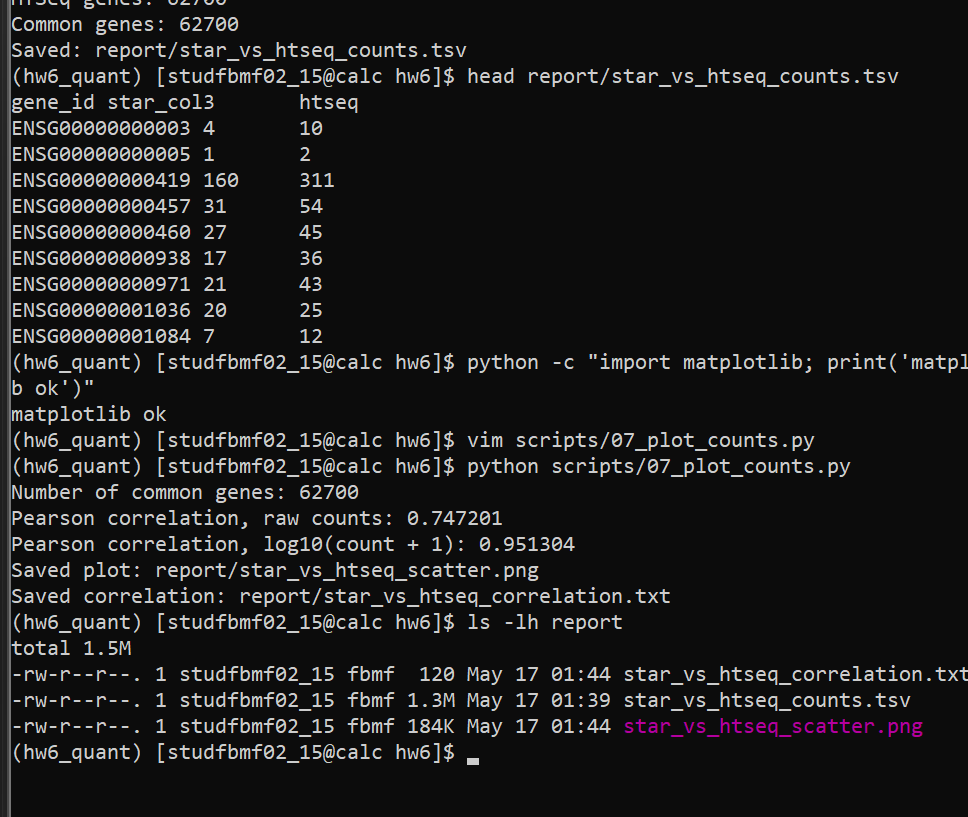
</p>

<p align="center"><em>Рисунок 19. Создание таблицы сравнения STAR и HTSeq-count.</em></p>

### Scatter plot

Для графика использовались значения `log10(count + 1)`, чтобы нормально отобразить гены с нулевыми и очень большими каунтами.

<p align="center">
  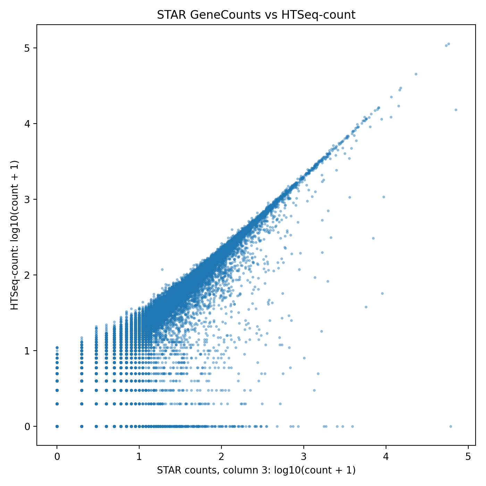
</p>

<p align="center"><em>Рисунок 20. Scatter plot: STAR GeneCounts vs HTSeq-count.</em></p>

Корреляция получилась такая:

```text
Pearson correlation, raw counts: 0.747201
Pearson correlation, log10(count + 1): 0.951304
```

Корреляция на логарифмированных каунтах высокая — **0.951304**. Это значит, что STAR GeneCounts и HTSeq-count в целом хорошо согласуются по общей структуре экспрессии генов. На сырых каунтах корреляция ниже — **0.747201**, потому что отдельные сильно экспрессированные гены и выбросы сильнее влияют на Pearson correlation.

### Почему результаты STAR и HTSeq могут не совпадать

STAR GeneCounts и HTSeq-count могут давать не одинаковые числа:

- они используют разные правила назначения рида гену;
- по-разному обрабатывают неоднозначные выравнивания;
- по-разному учитывают риды, попадающие в пересекающиеся гены;
- в `RNA_ReadsPerGene.out.tab` разные колонки соответствуют разным вариантам strandedness;
- HTSeq-count был явно запущен с `--stranded=no`, а в задании для сравнения бралась именно колонка 3 STAR.

При этом общая корреляция после логарифмирования получилась высокой.

---

## Результаты на сервере

Ниже показана итоговая структура папки `~/hw/hw6` и основные полученные файлы: отчёты FastQC/MultiQC, триммированные FASTQ, BAM от STAR, `RNA_ReadsPerGene.out.tab`, `transcripts.gtf`, `htseq_counts.txt`, таблица сравнения и scatter plot.

<p align="center">
  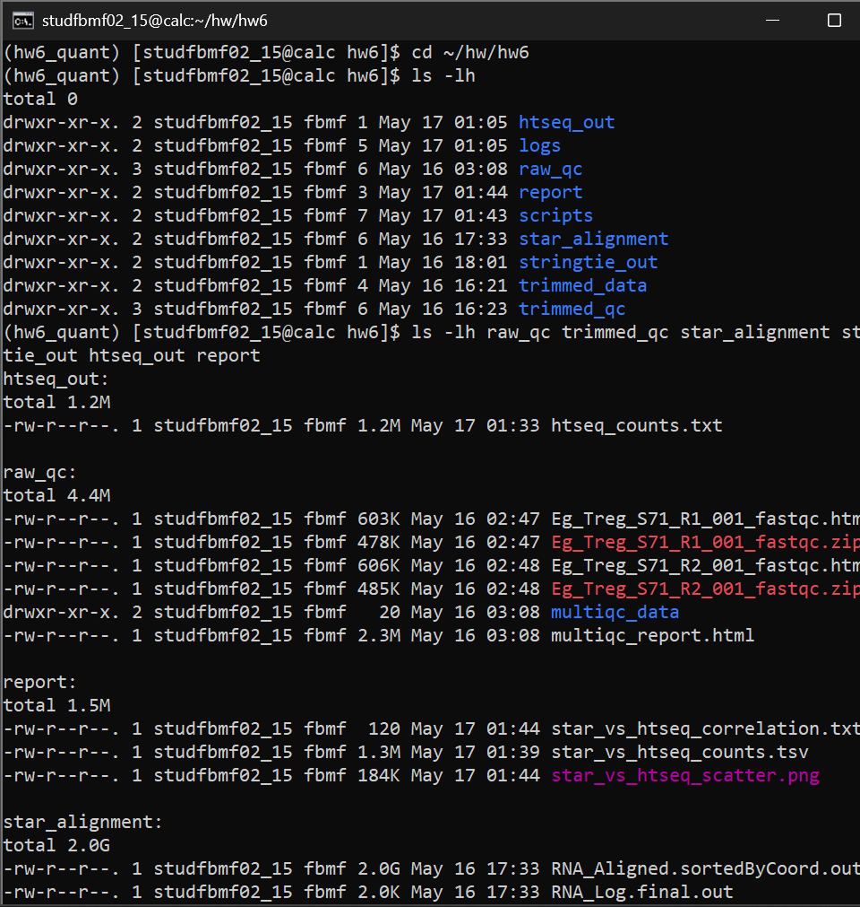
</p>

<p align="center"><em>Рисунок 21. Итоговая папка hw6 на сервере 1.</em></p>

<p align="center">
  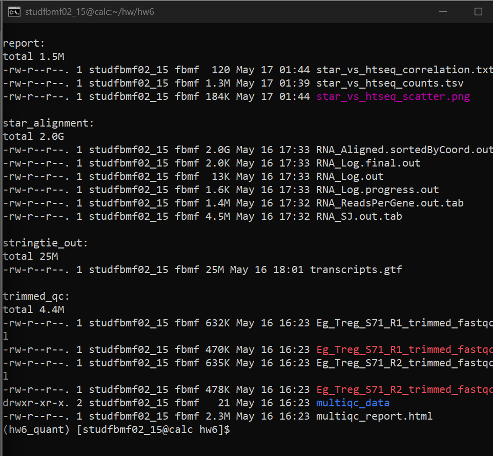
</p>

<p align="center"><em>Рисунок 22. Итоговая папка hw6 на сервере 2.</em></p>

---

## Что лучше использовать для дальнейшего DE-анализа

Для дальнейшего DE-анализа в DESeq2 или edgeR нужны сырые целочисленные gene counts, полученные одинаковым способом для всех образцов. В этой работе я бы выбрала **HTSeq-count**, потому что он явно использует GTF-аннотацию, режим `--type=exon`, `--idattr=gene_id` и параметр `--stranded=no`. То есть правила подсчёта заданы явно и легко воспроизводятся.

STAR GeneCounts тоже можно использовать для DESeq2/edgeR, если правильно выбрать колонку под strandedness библиотеки. Но в этой работе для сравнения бралась колонка 3 по заданию, а HTSeq-count был запущен как unstranded. Поэтому для дальнейшего анализа безопаснее взять HTSeq-count, либо, если использовать STAR, сначала точно определить strandedness библиотеки и выбрать правильную колонку из `RNA_ReadsPerGene.out.tab`.

Но смешивать STAR counts и HTSeq counts в одной матрице нельзя. Для всех образцов должен быть один и тот же способ подсчёта.

---

## Итоговые выводы

В дз6 были проанализированы paired-end RNA-seq риды `Eg_Treg_S71_R1_001.fastq.gz` и `Eg_Treg_S71_R2_001.fastq.gz`. Сначала был выполнен FastQC и собран общий MultiQC-отчёт для исходных данных. Исходные риды имели хорошее качество по позициям и почти нулевой N-content, но в данных были небольшие адаптерные/технические хвосты, сверхпредставленные poly-T последовательности и нестандартный GC-состав.

Затем был выполнен тримминг через fastp. После обработки сохранилось около **95.7%** ридов, средняя длина уменьшилась с **76 bp** до **74 bp**, а качество немного улучшилось: Q30 вырос с **90.23%** до **92.04%**. Основная часть удалённых ридов была связана с низким качеством, а слишком коротких ридов было около **0.61%**. GC-состав после тримминга почти не изменился, что логично, так как он связан с особенностями RNA-seq библиотеки.

После тримминга риды были выровнены на GRCh38 с помощью STAR. Выравнивание прошло успешно: уникально выровнялось **83.53%** ридов, а на несколько локусов — **5.63%**. Были получены отсортированный BAM-файл и файл `RNA_ReadsPerGene.out.tab`.

Далее StringTie в режиме de novo собрал **9727 транскриптов** и создал файл `transcripts.gtf`. После этого HTSeq-count посчитал каунты для **62700 генов** по GTF-аннотации GRCh38.

Сравнение STAR GeneCounts и HTSeq-count показало, что списки генов полностью совпали: **62700 общих генов**. Корреляция на сырых каунтах составила **0.747201**, а на `log10(count + 1)` — **0.951304**. Это говорит о хорошем общем согласии между методами, хотя отдельные каунты отличаются из-за разных правил назначения ридов генам, обработки неоднозначных выравниваний и strandedness.

В итоге получили, что данные после тримминга пригодны для дальнейшего анализа, выравнивание STAR прошло успешно, а для дальнейшего DE-анализа я бы использовала HTSeq-count, потому что этот метод в работе был запущен с явно заданными правилами подсчёта и аннотацией.
